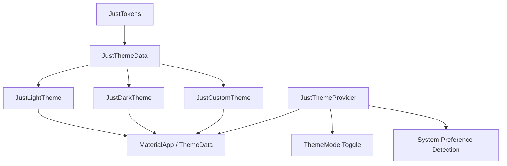

# Phase 1: Fondasi & Design System

> **Status:** 🟡 In Progress  
> **Target:** Sprint 1–4  
> **Packages:** `just_ui_tokens`, `just_ui_core` (theming), `just_ui_cli`  
> **Prioritas:** Critical — Semua fase berikutnya bergantung pada fondasi ini.

---

## Gambaran Umum

Phase 1 adalah pondasi absolut dari seluruh ekosistem JustUI. Tanpa token system yang solid, theming engine yang fleksibel, dan CLI scaffold yang produktif, seluruh komponen dan fitur di fase-fase berikutnya tidak akan memiliki standar yang konsisten.

Fase ini dibagi menjadi **3 milestone** utama:


---

## Milestone I — Token System

### Deskripsi

Token System adalah **single source of truth** untuk seluruh nilai visual primitif yang digunakan di seluruh komponen JustUI. Token didesain sebagai Dart constants dan class yang immutable, sehingga dapat dikonsumsi langsung oleh widget maupun oleh theming engine.

### Deliverables

#### 1. Color Tokens

| Token Category | Contoh Key | Deskripsi |
|---|---|---|
| `JustColors.primary` | `primary`, `primaryLight`, `primaryDark` | Warna utama brand |
| `JustColors.secondary` | `secondary`, `secondaryLight`, `secondaryDark` | Warna pendukung |
| `JustColors.neutral` | `neutral50` – `neutral950` | Skala abu-abu (11 tingkat) |
| `JustColors.semantic` | `success`, `warning`, `error`, `info` | Warna kontekstual |
| `JustColors.surface` | `background`, `card`, `elevated`, `overlay` | Warna permukaan/latar |
| `JustColors.border` | `borderDefault`, `borderFocus`, `borderError` | Warna border sesuai state |
| `JustColors.text` | `textPrimary`, `textSecondary`, `textDisabled`, `textInverse` | Warna teks |

**Struktur File:**
```
packages/just_ui_tokens/lib/
├── src/
│   └── colors/
│       ├── color_palette.dart        # Raw color palette (hex/ARGB values)
│       ├── color_semantic.dart       # Semantic mapping (success, error, dll)
│       └── color_tokens.dart         # Aggregated color tokens class
└── tokens.dart                       # Barrel export
```

**Spesifikasi Teknis:**
- Setiap warna memiliki minimal **11 shade** (50, 100, 200, ..., 900, 950) mengikuti pola Material 3.
- Warna disimpan sebagai `Color` constant (`const Color(0xFF...)`) untuk efisiensi compile-time.
- Semantic colors (`success`, `error`, dll.) mereferensi palette, bukan hardcoded hex.
- Alpha/opacity ditangani secara langsung menggunakan API modern Flutter `Color.withValues(alpha:)`. Extension kustom (seperti `withOpacity` yang deprecated) sengaja ditiadakan untuk menjaga kerapian API surface.

---

#### 2. Spacing Tokens

| Token | Value | Use Case |
|---|---|---|
| `JustSpacing.xxs` | `2.0` | Micro gap, icon-label spacing |
| `JustSpacing.xs` | `4.0` | Compact padding |
| `JustSpacing.sm` | `8.0` | Default inline spacing |
| `JustSpacing.md` | `12.0` | Standard padding |
| `JustSpacing.lg` | `16.0` | Section padding |
| `JustSpacing.xl` | `24.0` | Card internal padding |
| `JustSpacing.xxl` | `32.0` | Section gap |
| `JustSpacing.xxxl` | `48.0` | Page-level margin |
| `JustSpacing.huge` | `64.0` | Hero section spacing |

**Spesifikasi Teknis:**
- Skala berbasis **4px grid system** untuk konsistensi pixel-perfect.
- Disediakan helper `JustSpacing.insets(...)` yang mengembalikan `EdgeInsets` langsung.
- Disediakan `SizedBox` shortcut: `JustGap.sm`, `JustGap.md`, dll. (vertical & horizontal).

---

#### 3. Typography Tokens

| Token | Font Size | Weight | Line Height | Use Case |
|---|---|---|---|---|
| `JustTypo.displayLg` | `48px` | `Bold` | `1.2` | Hero headline |
| `JustTypo.displayMd` | `36px` | `Bold` | `1.2` | Section headline |
| `JustTypo.displaySm` | `30px` | `SemiBold` | `1.3` | Sub-headline |
| `JustTypo.headingLg` | `24px` | `SemiBold` | `1.3` | Page title |
| `JustTypo.headingMd` | `20px` | `SemiBold` | `1.4` | Card title |
| `JustTypo.headingSm` | `16px` | `SemiBold` | `1.4` | Section label |
| `JustTypo.bodyLg` | `18px` | `Regular` | `1.6` | Large body text |
| `JustTypo.bodyMd` | `16px` | `Regular` | `1.6` | Default body |
| `JustTypo.bodySm` | `14px` | `Regular` | `1.5` | Secondary text |
| `JustTypo.caption` | `12px` | `Regular` | `1.4` | Helper/caption |
| `JustTypo.overline` | `11px` | `Medium` | `1.5` | Label/overline |

**Spesifikasi Teknis:**
- Default font family: **Inter** (Google Fonts), dengan fallback ke system font.
- Monospace variant: **JetBrains Mono** untuk kode snippet.
- Setiap `TextStyle` sudah include `letterSpacing` yang proporsional.
- *Responsive typography* (misalnya `JustTypo.responsive(context)`) didefer ke Phase 2 (atau sebagai optional layout extension) untuk menghindari premature complexity dan menunggu finalisasi Breakpoint System.

---

#### 4. Border Radius Tokens

| Token | Value | Use Case |
|---|---|---|
| `JustRadius.none` | `0.0` | Sharp corners |
| `JustRadius.xs` | `2.0` | Subtle rounding |
| `JustRadius.sm` | `4.0` | Badge, tag |
| `JustRadius.md` | `8.0` | Button, input |
| `JustRadius.lg` | `12.0` | Card |
| `JustRadius.xl` | `16.0` | Modal, dialog |
| `JustRadius.xxl` | `24.0` | Floating panel |
| `JustRadius.full` | `9999.0` | Pill shape |

---

#### 5. Shadow / Elevation Tokens

| Token | Offset | Blur | Spread | Use Case |
|---|---|---|---|---|
| `JustShadow.xs` | `(0, 1)` | `2` | `0` | Subtle lift |
| `JustShadow.sm` | `(0, 2)` | `4` | `-1` | Card rest |
| `JustShadow.md` | `(0, 4)` | `8` | `-2` | Card hover |
| `JustShadow.lg` | `(0, 8)` | `16` | `-4` | Dropdown |
| `JustShadow.xl` | `(0, 16)` | `32` | `-6` | Modal |
| `JustShadow.xxl` | `(0, 24)` | `48` | `-8` | Toast / floating |

---

#### 6. Animation / Duration Tokens

| Token | Value | Curve | Use Case |
|---|---|---|---|
| `JustDuration.instant` | `50ms` | — | Micro feedback |
| `JustDuration.fast` | `150ms` | `easeOut` | Hover/focus |
| `JustDuration.normal` | `250ms` | `easeInOut` | Toggle, expand |
| `JustDuration.slow` | `400ms` | `easeInOut` | Page transition |
| `JustDuration.slower` | `600ms` | `cubic(0.16,1,0.3,1)` | Complex animation |

---

#### 7. Breakpoints (Layout Concern)

> [!NOTE]
> `JustBreakpoint` dipisahkan dari package `just_ui_tokens` karena merupakan layout/responsive concern, bukan pure visual token. Fitur ini dipindahkan ke package `just_ui_core` agar package tokens tetap bersih sebagai kumpulan primitives visual murni.

---

### Acceptance Criteria — Milestone I

- [ ] Semua token didefinisikan sebagai Dart constants (`const`) untuk tree-shaking optimal.
- [ ] Barrel export file `tokens.dart` meng-export seluruh token categories.
- [ ] Unit test memverifikasi setiap token value tidak `null` dan dalam range valid.
- [ ] Dokumentasi dartdoc pada setiap public class dan property.
- [ ] `dart analyze` zero warning pada package `just_ui_tokens`.

---

## Milestone II — Theming Engine (Light/Dark & Custom Theme)

### Deskripsi

Theming engine adalah layer abstraksi yang mengonsumsi token dari Milestone I dan mengubahnya menjadi `ThemeData` Flutter yang dapat di-swap secara dinamis (light ↔ dark ↔ custom) pada runtime.

### Arsitektur



### Deliverables

#### 1. `JustThemeData` — Theme Data Class

```dart
class JustThemeData {
  final JustColorScheme colors;
  final JustTypographyScheme typography;
  final JustSpacingScheme spacing;
  final JustRadiusScheme radius;
  final JustShadowScheme shadows;
  final JustAnimationScheme animations;

  /// Convert to Flutter ThemeData
  ThemeData toThemeData();

  /// Create a copy with overrides
  JustThemeData copyWith({...});
}
```

#### 2. Pre-built Themes

| Theme | Deskripsi |
|---|---|
| `JustTheme.light()` | Default light theme menggunakan token standar |
| `JustTheme.dark()` | Default dark theme (auto-inverted neutral, adjusted surfaces) |
| `JustTheme.custom({...})` | Factory untuk custom brand theme |

**Spesifikasi Teknis:**
- Dark theme **bukan** sekadar invert warna. Surface colors menggunakan palette terpisah yang di-optimize untuk readability di dark background.
- Semantic colors (success, error) di-adjust agar kontras WCAG AA (≥ 4.5:1) tetap terjaga di kedua mode.
- Custom theme mendukung **partial override**: developer hanya perlu define warna yang ingin diganti, sisanya inherit dari light/dark base.

#### Hubungan `JustThemeData` vs `ThemeExtension`
Untuk menghindari adanya dua sistem override paralel yang membingungkan:
- **`JustThemeData`**: Digunakan untuk konfigurasi global theme (skema warna global, typography global, spacing scheme global).
- **`ThemeExtension` (Flutter)**: Digunakan khusus untuk per-component override (misalnya, kustomisasi spesifik untuk widget Button, Input, atau Card tertentu).
- **Resolusi Konflik (Prioritas)**: Jika terjadi tabrakan properti (misal: warna background tombol diatur secara global di `JustThemeData.colors` dan didefinisikan secara khusus di `ThemeExtension` untuk Button), maka nilai dari **`ThemeExtension`** (per-component override) yang akan diprioritaskan untuk widget tersebut.

#### 3. `JustThemeProvider` — State Management

```dart
class JustThemeProvider extends InheritedWidget {
  const JustThemeProvider({
    super.key,
    required super.child,
    required this.theme,
    required this.mode,
    this.onThemeChanged,
    this.initialThemeMode,
  });

  /// Current active theme
  final JustThemeData theme;

  /// Current theme mode
  final ThemeMode mode;

  /// Optional callback to handle persistence (triggered on theme change)
  final void Function(ThemeMode)? onThemeChanged;

  /// Optional initial theme mode loaded from user's storage
  final ThemeMode? initialThemeMode;

  /// Toggle between light and dark
  void toggleTheme();

  /// Set specific theme mode
  void setThemeMode(ThemeMode mode);

  /// Apply custom theme
  void applyTheme(JustThemeData theme);

  /// Access from context
  static JustThemeProvider of(BuildContext context);
}
```

**Spesifikasi Teknis:**
- Menggunakan `InheritedWidget` + `ChangeNotifier` pattern (zero dependency ke state management library).
- **Zero-Dependency Persistence:** Package tidak bergantung pada `SharedPreferences` secara langsung. Proses penyimpanan status (persistence) diserahkan sepenuhnya ke user melalui callback `onThemeChanged` (misal menggunakan Hive, Hydrated BLoC, SharedPrefs, dll) dan pemuatan awal menggunakan `initialThemeMode` agar library tetap pure tanpa dependencies eksternal.
- Auto-detect system brightness via `MediaQuery.platformBrightnessOf(context)`.
- Smooth theme transition via `AnimatedTheme` dengan durasi `JustDuration.normal`.

#### 4. Extension Methods

```dart
// Quick access dari BuildContext
extension JustThemeContext on BuildContext {
  JustThemeData get justTheme => JustThemeProvider.of(this).theme;
  JustColorScheme get justColors => justTheme.colors;
  JustTypographyScheme get justTypo => justTheme.typography;
  JustSpacingScheme get justSpacing => justTheme.spacing;
}
```

### Acceptance Criteria — Milestone II

- [ ] Light & Dark theme render dengan benar di showcase app.
- [ ] Theme toggle berjalan smooth tanpa rebuild seluruh widget tree.
- [ ] Custom theme dengan partial override berfungsi.
- [ ] System preference detection bekerja di Android, iOS, Web, Desktop.
- [ ] Contrast ratio setiap text-on-surface ≥ 4.5:1 (WCAG AA).
- [ ] Theme callbacks (`onThemeChanged` dan `initialThemeMode`) terbukti dapat dipanggil dan diintegrasikan oleh storage engine eksternal.

---

## Milestone III — CLI Scaffold & Copy-Paste Workflow

### Deskripsi

`just_ui_cli` adalah command-line tool yang mempercepat onboarding developer baru dan menyediakan **copy-paste workflow** — konsep di mana developer tidak harus install seluruh library, melainkan bisa meng-copy komponen individual ke project mereka (terinspirasi oleh **shadcn/ui**).

### Global Tool Activation

CLI didesain untuk dapat diaktifkan secara global melalui pub.dev/local package sehingga pengguna dapat memanggil `justui` secara langsung tanpa harus mengetik `dart run just_ui_cli`.

Pada [packages/just_ui_cli/pubspec.yaml](file:///home/yourblooo/development/justui/packages/just_ui_cli/pubspec.yaml), executables didaftarkan sebagai berikut:
```yaml
executables:
  justui: just_ui_cli
```

Cara instalasi global oleh developer:
```bash
$ dart pub global activate just_ui_cli
```

### CLI Commands

#### 1. `justui init`

Inisialisasi project baru dengan JustUI.

```bash
$ justui init

✓ Detecting project type... (Flutter)
✓ Adding just_ui_tokens dependency...
✓ Creating justui.config.yaml...
✓ Setting up theme provider in main.dart...
✓ Done! JustUI initialized successfully.
```

**Config file yang di-generate (`justui.config.yaml`):**
```yaml
# justui.config.yaml
version: 1
style: default          # default (varian style lain didefer untuk menghindari premature differentiation)
theme:
  mode: system          # light | dark | system
  primary: "#6C5CE7"
  font_family: "Inter"
components_dir: lib/ui  # Target directory for copied components
tokens_dir: lib/tokens  # Target directory for copied tokens
```

#### 2. `justui add <component>`

Mendownload komponen individual dari registry URL ke project developer secara dinamis saat runtime (tidak di-embed di binary CLI).

```bash
$ justui add button

✓ Fetching component metadata from registry...
✓ Copying button component to lib/ui/button/...
  - just_button.dart
  - just_button_style.dart
  - just_button_variants.dart
✓ Adding required tokens...
✓ Updating barrel exports...
✓ Button component added successfully!

Dependencies added:
  - JustColors (from tokens)
  - JustRadius (from tokens)
  - JustTypo (from tokens)
```

#### 3. `justui list`

Menampilkan seluruh komponen yang tersedia di remote registry.

```bash
$ justui list

Available components:
  Primitives:
    ● button          A versatile button with 5 variants
    ● input           Text input with validation support
    ● badge           Small status indicator
    ● avatar          User avatar with fallback
  Layout:
    ● card            Elevated content container
    ● separator       Visual divider
    ○ skeleton        Loading placeholder     (coming soon)
  ...
```

#### 4. `justui theme`

Generate atau customize theme files.

```bash
$ justui theme generate --primary="#E84393" --mode=dark

✓ Generating custom theme...
✓ Writing to lib/tokens/custom_theme.dart...
✓ Theme generated successfully!
```

#### 5. `justui diff`

Menampilkan perbedaan antara komponen lokal yang sudah di-copy dengan versi terbaru di remote registry.

```bash
$ justui diff button

  Comparing local button with registry v1.2.0...
  
  ~ just_button.dart
    + Added: onLongPress callback
    ~ Changed: Default padding from 12 to 16
    
  Apply update? (y/n)
```

### Registry Format Specification

Untuk memastikan CLI dan remote registry kompatibel sejak hari pertama, remote registry akan menyajikan file index dengan format YAML (`registry/index.yaml`) yang berisi metadata komponen:

```yaml
# registry/index.yaml
components:
  - name: button
    version: "1.0.0"
    files:
      - path: "lib/ui/button/just_button.dart"
        type: component
      - path: "lib/ui/button/just_button_style.dart"
        type: style
      - path: "lib/ui/button/just_button_variants.dart"
        type: variant
    registry_dependencies: []
    pub_dependencies:
      - flutter_animate: "^1.0.0"
  - name: input
    version: "1.0.0"
    files:
      - path: "lib/ui/input/just_input.dart"
        type: component
    registry_dependencies: []
    pub_dependencies: []
```

### Struktur File CLI

Templates sengaja **tidak** di-embed ke dalam binary CLI melainkan di-download secara runtime. Ini mencegah template menjadi stale dan menjaga agar ukuran binary tetap ringan.

```
packages/just_ui_cli/
├── bin/
│   └── just_ui_cli.dart              # Entry point
├── lib/
│   ├── just_ui_cli.dart              # Barrel export
│   ├── src/
│   │   ├── commands/
│   │   │   ├── init_command.dart      # `justui init`
│   │   │   ├── add_command.dart       # `justui add`
│   │   │   ├── list_command.dart      # `justui list`
│   │   │   ├── theme_command.dart     # `justui theme`
│   │   │   └── diff_command.dart      # `justui diff`
│   │   ├── config/
│   │   │   ├── justui_config.dart     # Config parser
│   │   │   └── defaults.dart          # Default values
│   │   ├── registry/
│   │   │   ├── component_registry.dart # Registry API client
│   │   │   └── component_meta.dart     # Registry models
│   │   ├── generators/
│   │   │   ├── theme_generator.dart
│   │   │   └── component_copier.dart   # Remote downloader & file copier
│   │   └── utils/
│   │       ├── logger.dart
│   │       ├── file_utils.dart
│   │       └── pubspec_editor.dart
└── test/
```

### Acceptance Criteria — Milestone III

- [ ] `justui init` berhasil setup project baru tanpa error.
- [ ] `justui add <component>` berhasil mendownload file dari remote registry ke target directory.
- [ ] `justui list` menampilkan semua komponen dari remote registry.
- [ ] `justui theme generate` menghasilkan theme file valid.
- [ ] Config file (`justui.config.yaml`) terbaca dan diparse dengan benar.
- [ ] Seluruh command memiliki `--help` flag yang informatif.
- [ ] Unit test coverage ≥ 80% pada CLI logic.

---

## Risiko & Mitigasi

| Risiko | Dampak | Mitigasi |
|---|---|---|
| Token naming convention berubah di tengah jalan | Refactor masif di semua komponen | Lock naming convention sebelum Milestone I selesai, buat migration script |
| Dark theme contrast gagal WCAG | Accessibility complaint | Automated contrast checker di CI/CD pipeline |
| CLI template tidak sinkron dengan package | Developer mendapat versi lama | Versioning pada template + `justui diff` command |

---

## Definition of Done — Phase 1

- [ ] Package `just_ui_tokens` published ke internal registry.
- [ ] Package theming engine terintegrasi di `just_ui_core`.
- [ ] CLI `just_ui_cli` executable dan tested.
- [ ] Showcase app mendemonstrasikan theme switching.
- [ ] Seluruh kode memiliki dartdoc documentation.
- [ ] Zero warning dari `dart analyze` di seluruh packages.
- [ ] README.md di setiap package sudah lengkap.
