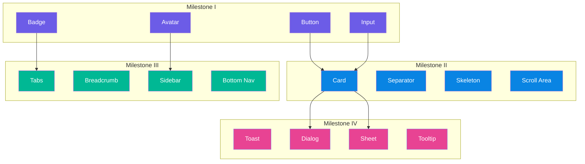

# Phase 2: Core Components

> **Status:** 🟡 In Progress (Milestone I & II Complete - 11 Components Finished)  
> **Target:** Sprint 5–10  
> **Packages:** `just_ui_core`  
> **Dependency:** Phase 1 (Token System + Theming Engine) harus **100% complete**  
> **Prioritas:** High — Ini adalah produk utama yang akan digunakan developer.

---

## Gambaran Umum

Phase 2 adalah jantung dari JustUI. Di sini seluruh komponen UI yang reusable akan dibangun di atas fondasi token dan theming yang sudah dikerjakan di Phase 1. Setiap komponen didesain mengikuti prinsip:

1. **Token-driven** — Tidak ada hardcoded value, semua mengacu ke token.
2. **Composable** — Komponen kecil bisa disusun menjadi komponen kompleks.
3. **Accessible** — WCAG 2.1 AA compliant sebagai minimum.
4. **Customizable** — Setiap komponen bisa di-override via style class.
5. **Performant** — `const` constructors wherever possible, minimal rebuild.



---

## Milestone I — Primitif (Button, Input, Badge, Avatar)

### Komponen 1: JustButton

#### Variants

| Variant | Deskripsi | Visual |
|---|---|---|
| `JustButton.primary()` | Filled button dengan warna primer | Solid background, white text |
| `JustButton.secondary()` | Outlined button dengan border | Transparent bg, colored border + text |
| `JustButton.ghost()` | Text-only tanpa border/background | Transparent, text color only |
| `JustButton.destructive()` | Aksi berbahaya (hapus, dll.) | Red-toned solid |
| `JustButton.link()` | Tampil seperti hyperlink | Underlined text, no padding |

#### Sizes

| Size | Height | Padding H | Font Size | Icon Size |
|---|---|---|---|---|
| `JustButtonSize.xs` | `28px` | `8px` | `12px` | `14px` |
| `JustButtonSize.sm` | `32px` | `12px` | `13px` | `16px` |
| `JustButtonSize.md` | `40px` | `16px` | `14px` | `18px` |
| `JustButtonSize.lg` | `48px` | `20px` | `16px` | `20px` |
| `JustButtonSize.xl` | `56px` | `24px` | `18px` | `22px` |

#### States

| State | Visual Behavior |
|---|---|
| `default` | Idle appearance |
| `hover` | Lightened/darkened background (±10%) |
| `pressed` | Scale down 0.97, darkened bg |
| `focused` | Focus ring (2px offset, primary color) |
| `disabled` | Opacity 0.5, non-interactive |
| `loading` | Replace label with spinner, disabled interaction |

#### API Surface

```dart
class JustButton extends StatelessWidget {
  const JustButton({
    required this.label,
    required this.onPressed,
    this.variant = JustButtonVariant.primary,
    this.size = JustButtonSize.md,
    this.leading,           // Widget? — icon sebelum label
    this.trailing,          // Widget? — icon sesudah label
    this.isLoading = false,
    this.isDisabled = false,
    this.isFullWidth = false,
    this.style,             // JustButtonStyle? — custom style override
  });
}

// Icon-only variant
class JustIconButton extends StatelessWidget {
  const JustIconButton({
    required this.icon,
    required this.onPressed,
    this.variant = JustButtonVariant.ghost,
    this.size = JustButtonSize.md,
    this.tooltip,           // String? — accessibility tooltip
  });
}
```

#### File Structure

```
packages/just_ui_core/lib/src/components/button/
├── just_button.dart           # Main button widget
├── just_icon_button.dart      # Icon-only variant
├── just_button_style.dart     # Style/theme class
├── just_button_variants.dart  # Variant definitions
└── just_button_group.dart     # Button group (horizontal/vertical)
```

---

### Komponen 2: JustInput

#### Variants

| Variant | Deskripsi |
|---|---|
| `JustInput.text()` | Standard text input |
| `JustInput.password()` | Obscured text + toggle visibility |
| `JustInput.search()` | Search icon prefix + clear button |
| `JustInput.number()` | Numeric keyboard, optional stepper |
| `JustInput.textarea()` | Multi-line input (auto-expand) |
| `JustInput.otp()` | OTP/PIN code input (segmented boxes) |

#### States

| State | Border Color | Label Behavior | Helper Text |
|---|---|---|---|
| `default` | `borderDefault` | Static above | Hint text shown |
| `focused` | `primary` | Floating/highlighted | Hint hidden |
| `filled` | `borderDefault` | Floating above | — |
| `error` | `error` | Red-tinted | Error message shown |
| `success` | `success` | Green-tinted | Success message shown |
| `disabled` | `neutral300` | Muted | — |
| `readOnly` | `neutral200` | Normal | — |

#### API Surface

```dart
class JustInput extends StatefulWidget {
  const JustInput({
    this.label,
    this.hint,
    this.helper,
    this.errorText,
    this.successText,
    this.controller,
    this.onChanged,
    this.onSubmitted,
    this.validator,           // String? Function(String?)? — form validation
    this.prefix,              // Widget? — icon/widget di kiri
    this.suffix,              // Widget? — icon/widget di kanan
    this.maxLength,
    this.maxLines = 1,
    this.obscureText = false,
    this.enabled = true,
    this.readOnly = false,
    this.autoFocus = false,
    this.keyboardType,
    this.inputFormatters,
    this.size = JustInputSize.md,
    this.style,               // JustInputStyle? — custom override
  });
}
```

#### Accessibility Requirements

- Label selalu terhubung via `Semantics`.
- Error message di-announce via `SemanticsService.announce`.
- Focus order mengikuti logical reading order.
- Sufficient touch target (min 48x48).

---

### Komponen 3: JustBadge

#### Variants

| Variant | Use Case |
|---|---|
| `JustBadge.solid()` | Status indicator (Active, Inactive) |
| `JustBadge.outline()` | Subtle category label |
| `JustBadge.soft()` | Tinted background, colored text |
| `JustBadge.dot()` | Notification dot (no text) |

#### API Surface

```dart
class JustBadge extends StatelessWidget {
  const JustBadge({
    this.label,               // String? — text content
    this.color = JustBadgeColor.primary,
    this.variant = JustBadgeVariant.solid,
    this.size = JustBadgeSize.md,
    this.leading,             // Widget? — icon sebelum label
    this.onDismiss,           // VoidCallback? — jika dismissible
    this.maxWidth,            // double? — truncate dengan ellipsis
  });
}
```

---

### Komponen 4: JustAvatar

#### Variants

| Variant | Fallback Behavior |
|---|---|
| `JustAvatar.image()` | Tampilkan image, fallback ke initials |
| `JustAvatar.initials()` | Tampilkan 1-2 huruf inisial |
| `JustAvatar.icon()` | Tampilkan icon (default: person) |
| `JustAvatar.group()` | Stack beberapa avatar (overlap) |

#### Sizes

| Size | Diameter | Font Size |
|---|---|---|
| `xs` | `24px` | `10px` |
| `sm` | `32px` | `12px` |
| `md` | `40px` | `14px` |
| `lg` | `48px` | `16px` |
| `xl` | `64px` | `20px` |
| `xxl` | `96px` | `28px` |

#### API Surface

```dart
class JustAvatar extends StatelessWidget {
  const JustAvatar({
    this.imageUrl,
    this.name,                // String? — untuk generate initials
    this.icon,
    this.size = JustAvatarSize.md,
    this.shape = JustAvatarShape.circle,  // circle | rounded
    this.border,              // Border? — online/status indicator
    this.statusDot,           // JustAvatarStatus? — online/offline/away/busy
    this.onTap,
  });
}

class JustAvatarGroup extends StatelessWidget {
  const JustAvatarGroup({
    required this.avatars,    // List<JustAvatar>
    this.maxDisplay = 3,      // Tampilkan max N, sisanya "+X"
    this.overlap = 8.0,       // Pixel overlap
    this.size = JustAvatarSize.md,
  });
}
```

### Acceptance Criteria — Milestone I

- [x] Setiap komponen memiliki semua variant yang di-spek.
- [x] Semua state (hover, focus, disabled, loading) berfungsi.
- [x] Komponen terintegrasi dengan theming engine (ikut berubah saat switch theme).
- [x] Widget test untuk setiap variant dan state.
- [x] Golden test untuk visual regression (minimal 1 per variant).
- [x] Accessibility test: semantic labels, focus traversal.
- [ ] Showcase page di `apps/showcase` untuk setiap komponen.

---

## Milestone II — Layout (Card, Separator, Skeleton, Scroll)

### Komponen 5: JustCard

#### Variants

| Variant | Deskripsi |
|---|---|
| `JustCard.elevated()` | Shadow-based elevation |
| `JustCard.outlined()` | Border-only, no shadow |
| `JustCard.filled()` | Filled background, no border |
| `JustCard.interactive()` | Clickable card dengan hover state |

#### API Surface

```dart
class JustCard extends StatelessWidget {
  const JustCard({
    required this.child,
    this.variant = JustCardVariant.elevated,
    this.padding,             // EdgeInsets? — default: JustSpacing.lg all
    this.margin,
    this.width,
    this.height,
    this.onTap,               // VoidCallback? — makes it interactive
    this.header,              // Widget? — card header section
    this.footer,              // Widget? — card footer section
    this.style,
  });
}
```

---

### Komponen 6: JustSeparator

```dart
class JustSeparator extends StatelessWidget {
  const JustSeparator({
    this.direction = Axis.horizontal,
    this.thickness = 1.0,
    this.color,               // Color? — default: borderDefault
    this.indent = 0.0,        // Leading indent
    this.endIndent = 0.0,     // Trailing indent
    this.label,               // String? — "OR" divider text
    this.labelStyle,
  });
}
```

---

### Komponen 7: JustSkeleton

Skeleton/shimmer loading placeholder yang auto-match layout komponen aslinya.

#### Variants

| Variant | Deskripsi |
|---|---|
| `JustSkeleton.text()` | Placeholder untuk teks (baris-baris) |
| `JustSkeleton.circle()` | Placeholder untuk avatar |
| `JustSkeleton.rect()` | Placeholder untuk image/card |
| `JustSkeleton.card()` | Preset card skeleton (image + text lines) |
| `JustSkeleton.list()` | Preset list item skeleton |

#### Animation

- **Shimmer effect** menggunakan `LinearGradient` animated dengan `AnimationController`.
- **Pulse effect** alternatif menggunakan opacity animation.
- Animasi bisa di-disable via `JustSkeleton.animated = false` untuk testing.

```dart
class JustSkeleton extends StatefulWidget {
  const JustSkeleton({
    this.width,
    this.height,
    this.borderRadius,
    this.animation = JustSkeletonAnimation.shimmer,
    this.baseColor,           // Default: neutral200 (light) / neutral800 (dark)
    this.highlightColor,      // Default: neutral100 (light) / neutral700 (dark)
    this.duration,            // Default: JustDuration.slow * 2
  });
  
  // Named constructors
  const JustSkeleton.text({this.lines = 3, this.lastLineWidth = 0.6});
  const JustSkeleton.circle({this.diameter = 40});
  const JustSkeleton.rect({required this.width, required this.height});
}
```

---

### Komponen 8: JustScrollArea

Custom scroll area dengan scroll indicator, fade edges, dan scroll-to-top button.

```dart
class JustScrollArea extends StatefulWidget {
  const JustScrollArea({
    required this.child,
    this.direction = Axis.vertical,
    this.showScrollbar = true,
    this.fadeEdges = false,        // Gradient fade di top/bottom edges
    this.scrollToTopButton = false, // Floating button saat scroll down
    this.physics,
    this.controller,
    this.padding,
    this.maxHeight,
    this.onScrollStart,
    this.onScrollEnd,
    this.onReachBottom,           // VoidCallback? — infinite scroll trigger
  });
}
```

### Acceptance Criteria — Milestone II

- [x] Card variants berfungsi dengan shadow/border sesuai theme.
- [x] Separator support horizontal dan vertical + label.
- [x] Skeleton shimmer animation berjalan smooth (60fps).
- [x] ScrollArea fade edges dan scroll-to-top berfungsi.
- [x] Semua komponen responsive terhadap theme changes.
- [x] Widget test dan golden test per komponen.

---

## Milestone III — Navigation (Tabs, Breadcrumb, Sidebar, BottomNav)

### Komponen 9: JustTabs

#### Variants

| Variant | Deskripsi |
|---|---|
| `JustTabs.line()` | Underline indicator (default) |
| `JustTabs.enclosed()` | Card-style enclosed tabs |
| `JustTabs.pill()` | Pill/chip shape tabs |
| `JustTabs.vertical()` | Vertical tab layout |

```dart
class JustTabs extends StatefulWidget {
  const JustTabs({
    required this.tabs,       // List<JustTab>
    this.variant = JustTabVariant.line,
    this.initialIndex = 0,
    this.onChanged,           // void Function(int)?
    this.isScrollable = false,
    this.controller,          // JustTabController?
  });
}

class JustTab {
  final String label;
  final Widget? icon;
  final Widget content;       // Tab panel content
  final bool enabled;
  final JustBadge? badge;     // Optional notification badge
}
```

**Spesifikasi Teknis:**
- Animated indicator slide antar tab.
- Swipe gesture support untuk mobile.
- Lazy loading tab content (hanya render tab yang aktif).
- Keyboard navigation (arrow keys untuk switch tab).

---

### Komponen 10: JustBreadcrumb

```dart
class JustBreadcrumb extends StatelessWidget {
  const JustBreadcrumb({
    required this.items,      // List<JustBreadcrumbItem>
    this.separator,           // Widget? — default: "/"
    this.maxItems,            // int? — collapse middle items jika > max
    this.collapsed,           // Widget? — custom collapsed indicator ("...")
  });
}

class JustBreadcrumbItem {
  final String label;
  final VoidCallback? onTap;  // null = current page (non-clickable)
  final Widget? icon;
}
```

---

### Komponen 11: JustSidebar

```dart
class JustSidebar extends StatefulWidget {
  const JustSidebar({
    required this.items,        // List<JustSidebarItem>
    this.header,                // Widget? — logo/brand area
    this.footer,                // Widget? — user profile/settings
    this.width = 260,
    this.collapsedWidth = 68,
    this.isCollapsible = true,
    this.isCollapsed = false,
    this.onCollapsedChanged,
    this.selectedIndex = 0,
    this.onItemSelected,
    this.variant = JustSidebarVariant.default_, // default | floating | inset
  });
}

class JustSidebarItem {
  final String label;
  final Widget icon;
  final VoidCallback? onTap;
  final JustBadge? badge;
  final List<JustSidebarItem>? children; // Nested/submenu items
  final bool enabled;
}
```

**Spesifikasi Teknis:**
- Smooth collapse/expand animation.
- Tooltip muncul saat collapsed (menampilkan label).
- Nested items dengan expand/collapse chevron.
- Active item indicator (left bar / background highlight).
- Responsive: auto-collapse di breakpoint `md` ke bawah, menjadi drawer.

---

### Komponen 12: JustBottomNav

```dart
class JustBottomNav extends StatefulWidget {
  const JustBottomNav({
    required this.items,         // List<JustBottomNavItem> (min 3, max 5)
    this.selectedIndex = 0,
    this.onItemSelected,
    this.variant = JustBottomNavVariant.fixed, // fixed | shifting | floating
    this.showLabels = true,
    this.hapticFeedback = true,
  });
}

class JustBottomNavItem {
  final String label;
  final Widget icon;
  final Widget? activeIcon;    // Different icon saat selected
  final JustBadge? badge;
}
```

**Spesifikasi Teknis:**
- `fixed`: Semua item tampil equal-width.
- `shifting`: Item aktif expand, sisanya shrink.
- `floating`: Floating bar dengan margin dan border radius.
- Animated icon transition saat switch.
- Safe area aware (menghormati system navigation bar).

### Acceptance Criteria — Milestone III

- [ ] Tabs: animated indicator, swipe gesture, keyboard nav.
- [ ] Breadcrumb: collapsible, clickable links.
- [ ] Sidebar: collapse/expand, nested items, responsive drawer fallback.
- [ ] BottomNav: 3 variants, badge support, haptic feedback.
- [ ] Semua komponen mendukung RTL layout.
- [ ] Widget test dan golden test per komponen.

---

## Milestone IV — Feedback (Toast, Dialog, Sheet, Tooltip)

### Komponen 13: JustToast

#### Variants

| Variant | Icon | Color |
|---|---|---|
| `JustToast.info()` | ℹ️ Info | `info` (blue) |
| `JustToast.success()` | ✅ Check | `success` (green) |
| `JustToast.warning()` | ⚠️ Alert | `warning` (amber) |
| `JustToast.error()` | ❌ Error | `error` (red) |
| `JustToast.custom()` | Custom | Custom color |

#### API — Imperative (recommended)

```dart
// Dari mana saja dalam widget tree
JustToast.show(
  context,
  message: "File uploaded successfully!",
  type: JustToastType.success,
  position: JustToastPosition.topRight,
  duration: Duration(seconds: 3),
  action: JustToastAction(
    label: "Undo",
    onPressed: () => undoUpload(),
  ),
  onDismissed: () => print("Toast dismissed"),
);

// Dismiss semua toast
JustToast.dismissAll();
```

**Spesifikasi Teknis:**
- Toast menggunakan `OverlayEntry`, bukan `SnackBar` bawaan Flutter.
- Stack multiple toast (max 5 visible, sisanya queue).
- Swipe-to-dismiss di mobile.
- Auto-dismiss dengan progress indicator.
- Slide-in animation dari posisi yang dikonfigurasi.
- Pause auto-dismiss saat hover (desktop).

---

### Komponen 14: JustDialog

#### Variants

| Variant | Use Case |
|---|---|
| `JustDialog.alert()` | Simple alert dengan 1 button |
| `JustDialog.confirm()` | Konfirmasi dengan 2 button (cancel + confirm) |
| `JustDialog.destructive()` | Konfirmasi aksi berbahaya (red CTA) |
| `JustDialog.form()` | Dialog dengan form input |
| `JustDialog.custom()` | Fully custom content |

#### API

```dart
// Imperative API
final result = await JustDialog.show<bool>(
  context,
  variant: JustDialogVariant.confirm,
  title: "Delete Project?",
  description: "This action cannot be undone. All data will be permanently deleted.",
  confirmLabel: "Delete",
  cancelLabel: "Cancel",
  isDestructive: true,
);

if (result == true) {
  // User confirmed deletion
}
```

```dart
// Declarative / Custom
JustDialog.show(
  context,
  builder: (context) => JustDialogContent(
    title: "Edit Profile",
    content: Column(children: [
      JustInput(label: "Name", controller: nameCtrl),
      JustInput(label: "Email", controller: emailCtrl),
    ]),
    actions: [
      JustButton.secondary(label: "Cancel", onPressed: () => Navigator.pop(context)),
      JustButton.primary(label: "Save", onPressed: () => saveProfile()),
    ],
  ),
);
```

**Spesifikasi Teknis:**
- Barrier color: `Colors.black.withOpacity(0.4)` (tap outside = dismiss, configurable).
- Scale + fade entrance animation.
- Focus trap di dalam dialog.
- Escape key dismiss (desktop).
- Max width: `480px`, responsif di mobile (full-width dengan margin).

---

### Komponen 15: JustSheet

#### Variants

| Variant | Deskripsi |
|---|---|
| `JustSheet.bottom()` | Bottom sheet (mobile-first) |
| `JustSheet.side()` | Side sheet / drawer (tablet/desktop) |

```dart
// Bottom Sheet
JustSheet.showBottom(
  context,
  title: "Sort By",
  child: Column(children: [
    JustListTile(title: "Newest First", onTap: () {}),
    JustListTile(title: "Oldest First", onTap: () {}),
    JustListTile(title: "A-Z", onTap: () {}),
  ]),
  isDismissible: true,
  showDragHandle: true,
  snapPoints: [0.3, 0.6, 1.0],  // Multi-snap bottom sheet
);

// Side Sheet
JustSheet.showSide(
  context,
  title: "Filters",
  width: 360,
  position: JustSheetPosition.right,  // left | right
  child: FilterWidget(),
);
```

**Spesifikasi Teknis:**
- Bottom sheet mendukung **multi-snap points** (drag antar height).
- Drag handle visual indicator.
- Side sheet otomatis beralih ke bottom sheet di mobile breakpoint.
- Backdrop scrim yang interactive.

---

### Komponen 16: JustTooltip

```dart
class JustTooltip extends StatelessWidget {
  const JustTooltip({
    required this.content,         // Widget — tooltip content
    required this.child,           // Widget — trigger element
    this.position = JustTooltipPosition.top,
    this.trigger = JustTooltipTrigger.hover, // hover | tap | longPress | manual
    this.delay = const Duration(milliseconds: 500),
    this.showArrow = true,
    this.maxWidth = 240,
    this.style,
  });
}
```

**Spesifikasi Teknis:**
- Smart positioning: auto-flip jika tidak cukup ruang.
- Arrow pointer yang mengarah ke trigger element.
- Support rich content (multi-line text, bahkan mini-widgets).
- Dismissible via tap anywhere (mobile), mouse leave (desktop).
- Accessible: linked via `Semantics.tooltip`.

### Acceptance Criteria — Milestone IV

- [ ] Toast: stack, queue, swipe-dismiss, auto-dismiss, pause on hover.
- [ ] Dialog: alert/confirm/destructive/form/custom, focus trap, escape dismiss.
- [ ] Sheet: bottom multi-snap, side sheet, responsive fallback.
- [ ] Tooltip: smart positioning, arrow, hover/tap trigger.
- [ ] Seluruh feedback component non-intrusive (tidak memblock UI kecuali Dialog).
- [ ] Widget test dan golden test per komponen.
- [ ] Showcase page mendemonstrasikan interaksi penuh.

---

## Component Architecture Pattern

Setiap komponen di `just_ui_core` mengikuti pattern yang konsisten:

```
lib/src/components/<component_name>/
├── <component_name>.dart           # Main widget (public API)
├── <component_name>_style.dart     # Style/theme class
├── <component_name>_variants.dart  # Enum variants + factory definitions
├── <component_name>_controller.dart # Controller (jika stateful complex)
└── <component_name>_theme.dart     # Theme extension for component
```

**Barrel Export Pattern:**
```dart
// lib/src/components/components.dart
export 'button/just_button.dart';
export 'input/just_input.dart';
export 'badge/just_badge.dart';
// ... dst

// lib/just_ui_core.dart (package entry)
export 'src/components/components.dart';
export 'src/theme/theme.dart';
```

---

## Testing Strategy

| Test Type | Tool | Coverage Target | Purpose |
|---|---|---|---|
| Unit Test | `flutter_test` | 90%+ | Logic, state, callback |
| Widget Test | `flutter_test` | 85%+ | Rendering, interaction |
| Golden Test | `golden_toolkit` | 1 per variant | Visual regression |
| Accessibility Test | `flutter_test` + `Semantics` | 100% | Screen reader, focus |
| Integration Test | `integration_test` | Showcase app | End-to-end component flow |

---

## Risiko & Mitigasi

| Risiko | Dampak | Mitigasi |
|---|---|---|
| API surface terlalu besar / bloated | Developer bingung | Keep required params minimal, gunakan named constructors |
| Performance bottleneck di list/scroll | Jank UI | Profiling rutin, `const` constructors, `RepaintBoundary` |
| Inkonsistensi visual antar komponen | Design terasa tidak unified | Design review checklist + golden test |
| Platform-specific bugs (iOS vs Android) | Bug reports | Platform-specific testing di CI |

---

## Definition of Done — Phase 2

- [/] 11 dari 12 komponen core selesai dan tested.
- [ ] Setiap komponen memiliki dartdoc + usage example di docstring.
- [ ] Showcase app menampilkan galeri interaktif seluruh komponen.
- [ ] Seluruh komponen lulus accessibility audit.
- [x] Zero warning dari `dart analyze`.
- [ ] Golden test baseline ter-commit untuk visual regression.
- [ ] README.md di `just_ui_core` mencantumkan seluruh komponen.
- [ ] Breaking change policy terdokumentasi (CHANGELOG.md).
