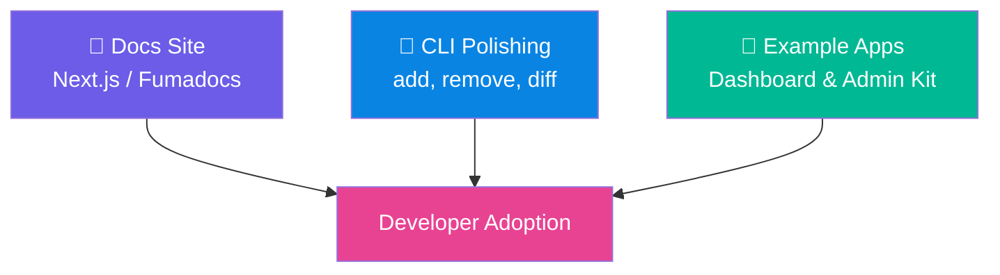
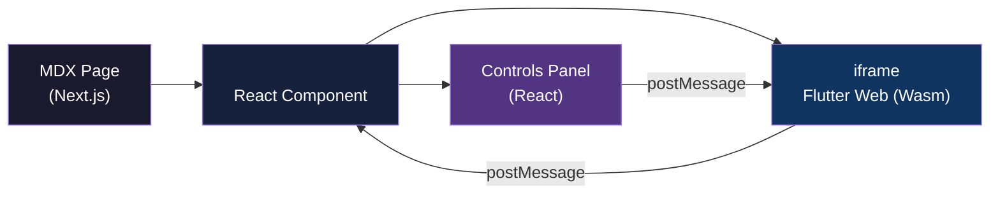

# Phase 3: Docs, DX & Showcase

> **Status:** 🟡 In Progress  
> **Target:** Sprint 11–16  
> **Packages:** `justui` (CLI rewritten in Rust), `apps/docs` (Next.js site)  
> **Dependency:** Phase 2 Milestone I–II minimal harus complete (komponen primitif + layout tersedia)  
> **Prioritas:** High — Adopsi developer sangat bergantung pada kualitas dokumentasi dan DX.

---

## Gambaran Umum

Phase 3 adalah **multiplier** — fase ini tidak menambahkan komponen UI baru, tetapi memastikan semua yang sudah dibangun di Phase 1 & 2 **mudah ditemukan, dipahami, dan digunakan** oleh developer manapun. Tanpa docs yang baik, library paling bagus sekalipun tidak akan diadopsi.

Fase ini mencakup 3 pilar:



---

## Milestone I — Docs Site (Next.js/Fumadocs) dengan Live Preview Widget

### Deskripsi

Website dokumentasi publik yang menjadi **sumber kebenaran tunggal** bagi developer yang ingin menggunakan JustUI. Dibangun dengan **Next.js + Fumadocs** (MDX-based docs framework) dengan fitur unik: **live Flutter widget preview** (di-compile menggunakan WebAssembly) yang ter-embed langsung di halaman dokumentasi.

### Tech Stack

| Layer | Technology | Alasan |
|---|---|---|
| Framework | Next.js 16 (App Router, React 19) | SSR, SEO, performa tertinggi |
| Bahasa Pemrograman | TypeScript 6.0.3 | Memberikan type safety penuh & integrasi template Fumadocs. |
| Docs Engine | Fumadocs 14.x | MDX support, sidebar auto-gen, search terintegrasi |
| Styling | Tailwind CSS v4 (CSS-first) | Rapid styling untuk docs site via @theme directive (tanpa tailwind.config) |
| Live Preview | (Ditangguhkan) | Fitur pratinjau interaktif Flutter Web ditangguhkan sementara; dokumentasi menggunakan kode & pratinjau statis. |
| Package Manager | Bun | Runtime & package manager yang sangat cepat |
| Tooling | ESLint v9 Flat Config, Prettier v3, Vitest, Playwright | Komplet dengan linter, formatter, unit testing & E2E testing |
| Search | Fumadocs Built-in Search (Orama) | Client-side fuzzy search, 0ms network latency, zero 3rd-party dependencies |
| Deployment | Vercel / Cloudflare Pages | Edge CDN, auto-deploy dari Git |
| Analytics | Plausible / Umami | Privacy-friendly analytics |

### Struktur Halaman

```
docs.justui.dev/
├── /                          # Landing page (hero + feature overview)
├── /getting-started
│   ├── /installation          # Install via pub, CLI, atau copy-paste
│   ├── /quick-start           # 5-menit tutorial
│   ├── /theming               # Setup tema custom
│   └── /cli-setup             # Install dan konfigurasi CLI
├── /components
│   ├── /overview              # Component catalog grid
│   ├── /button                # Per-komponen docs
│   ├── /input
│   ├── /badge
│   ├── /avatar
│   ├── /card
│   ├── /...                   # Setiap komponen punya halaman sendiri
├── /tokens
│   ├── /colors                # Color palette explorer
│   ├── /typography            # Type scale viewer
│   ├── /spacing               # Spacing visualizer
│   └── /shadows               # Shadow gallery
├── /guides
│   ├── /copy-paste-workflow   # Cara pakai model copy-paste
│   ├── /custom-theme          # Deep dive theming
│   ├── /accessibility         # A11y guidelines
│   ├── /responsive-design     # Breakpoints dan adaptive layout
│   └── /migration             # Upgrade guide antar versi
├── /examples
│   ├── /dashboard             # Live demo dashboard
│   └── /admin-panel           # Live demo admin panel
├── /changelog                 # Version history
└── /community                 # Contribute, RFC, discussion links
```

### Per-Component Documentation Page Template

Setiap halaman komponen mengikuti template standar:

```markdown
# Button

Brief description of the component and its purpose.

## Live Preview
<!-- Embedded Flutter Web widget dengan kontrol interaktif -->
<LivePreview component="button" />

## Installation

### Via CLI (Recommended)
```bash
justui add button
```

### Via pubspec.yaml
```yaml
dependencies:
  just_ui_core: ^1.0.0
```

## Usage

### Basic
```dart
JustButton.primary(
  label: "Click me",
  onPressed: () {},
)
```

### With Icon
```dart
JustButton.primary(
  label: "Upload",
  leading: Icon(Icons.upload),
  onPressed: () {},
)
```

## Variants
<!-- Visual grid showing all variants side-by-side -->
<VariantGrid component="button" />

## Props / API Reference
<!-- Auto-generated props table dari Dart source -->
<PropsTable component="button" />

## Theming
<!-- Cara customize styling -->

## Accessibility
<!-- ARIA roles, keyboard nav, screen reader behavior -->

## Related Components
<!-- Links ke komponen terkait -->
```

### Live Preview Widget — Arsitektur (Ditangguhkan)

> [!WARNING]
> Fitur pratinjau interaktif Flutter Web (Wasm) ditangguhkan seiring dihapusnya direktori `apps/showcase` dan `apps/template`. Bagian ini dipertahankan sebagai referensi arsitektur masa depan ketika sandbox diaktifkan kembali.



**Cara kerja:**
1. Docs page meng-embed iframe yang menjalankan Flutter Web app khusus (showcase app yang di-compile ke web).
2. React component `<LivePreview />` menampilkan controls panel (toggle variant, size, state, theme).
3. User mengubah kontrol → kirim `postMessage` ke iframe → Flutter app menerima dan merender ulang widget.
4. Flutter app mengirim kembali metadata (ukuran widget, dsb.) ke React untuk auto-resize iframe.

**Deliverables:**
- [ ] Flutter Web showcase app yang menerima konfigurasi via `postMessage`.
- [ ] React `<LivePreview />` component dengan kontrol panel.
- [ ] Lazy loading iframe (hanya load saat masuk viewport).
- [ ] Fallback: static screenshot jika Flutter Web gagal load.
- [ ] Dark/Light mode toggle yang sync antara docs site dan preview.

### Landing Page Design

Landing page harus memberikan **first impression premium**:

| Section | Konten |
|---|---|
| Hero | Tagline + animated component showcase + Install CTA |
| Features | 4-6 key features dengan icons (Copy-paste, Themeable, Accessible, dll) |
| Component Showcase | Interactive carousel dari komponen populer |
| Code Preview | Side-by-side: code snippet ↔ rendered output |
| Testimonials | (Placeholder untuk fase growth) |
| Get Started | Installation steps + links |

### SEO Requirements

- [ ] Meta title/description unik per halaman.
- [ ] OpenGraph image auto-generated per halaman komponen.
- [ ] Structured data (JSON-LD) untuk docs breadcrumb.
- [ ] `sitemap.xml` auto-generated.
- [ ] `robots.txt` configured.
- [ ] Core Web Vitals: LCP < 2.5s, FID < 100ms, CLS < 0.1.

### Acceptance Criteria — Milestone I

- [ ] Docs site deployed dan accessible via custom domain.
- [ ] Minimal 80% komponen dari Phase 2 terdokumentasi.
- [ ] Live Preview berfungsi di Chrome, Firefox, Safari.
- [ ] Search berfungsi dan mengembalikan hasil relevan.
- [ ] Mobile responsive (docs site, bukan preview widget).
- [ ] Dark mode support di docs site.
- [ ] Page load time < 3 detik di 3G simulated.

---

## Milestone II — CLI Polishing (Add, Remove, Diff)

### Deskripsi

Menyempurnakan CLI yang sudah di-scaffold di Phase 1 Milestone III menjadi tool yang production-ready dengan UX yang polished, error handling yang robust, dan fitur tambahan (`remove`, `diff`, `update`).

### Command Enhancements

#### 1. `justui add <component>` — Enhanced

**Peningkatan dari Phase 1:**

```bash
$ dart run just_ui_cli add button input card

✓ Resolving dependencies...
  button requires: [tokens/colors, tokens/radius, tokens/typography, tokens/spacing]
  input requires:  [tokens/colors, tokens/radius, tokens/typography, tokens/spacing]
  card requires:   [tokens/colors, tokens/radius, tokens/shadows, tokens/spacing]

✓ Deduplicating shared dependencies...
  Shared tokens: [colors, radius, typography, spacing, shadows]

✓ Copying components...
  → lib/ui/button/just_button.dart
  → lib/ui/button/just_button_style.dart
  → lib/ui/button/just_button_variants.dart
  → lib/ui/input/just_input.dart
  → lib/ui/input/just_input_style.dart
  → lib/ui/card/just_card.dart
  → lib/ui/card/just_card_style.dart
  → lib/ui/card/just_card_variants.dart

✓ Copying token dependencies...
  → lib/tokens/colors.dart
  → lib/tokens/radius.dart
  → lib/tokens/typography.dart
  → lib/tokens/spacing.dart
  → lib/tokens/shadows.dart

✓ Generating barrel exports...
  → lib/ui/ui.dart
  → lib/tokens/tokens.dart

✓ 3 components + 5 token files added successfully!
```

**Fitur tambahan:**
- Batch add (multiple components sekaligus).
- Dependency resolution (otomatis tambahkan token yang dibutuhkan).
- Deduplication (token yang sudah ada tidak di-copy ulang).
- Conflict detection (warn jika file sudah ada, prompt overwrite).
- `--dry-run` flag untuk preview tanpa menulis file.
- `--path` flag untuk custom output directory.

---

#### 2. `justui remove <component>` — New

```bash
$ dart run just_ui_cli remove card

⚠ Checking for dependents...
  No other components depend on 'card'.

✓ Removing component files...
  ✗ lib/ui/card/just_card.dart
  ✗ lib/ui/card/just_card_style.dart
  ✗ lib/ui/card/just_card_variants.dart

✓ Checking orphaned tokens...
  shadows.dart is still used by: [dialog, tooltip]
  → Keeping shadows.dart

✓ Updating barrel exports...
  → lib/ui/ui.dart (updated)

✓ Component 'card' removed successfully!
```

**Spesifikasi:**
- Cek dependents sebelum remove (warn jika ada komponen lain yang bergantung).
- Hapus hanya file yang terkait komponen tersebut.
- Check orphaned tokens: hapus token yang sudah tidak digunakan oleh komponen apapun.
- Update barrel exports otomatis.
- `--force` flag untuk skip konfirmasi.

---

#### 3. `justui diff <component>` — Enhanced

```bash
$ dart run just_ui_cli diff button

  Comparing local version with registry v1.3.0...
  Local version: v1.2.0 (copied on 2026-05-20)

  Changes in button:

  ┌─ just_button.dart ──────────────────────────────────────────┐
  │ @@ -15,6 +15,8 @@                                          │
  │    this.isLoading = false,                                  │
  │    this.isDisabled = false,                                 │
  │    this.isFullWidth = false,                                │
  │ +  this.onLongPress,          // NEW: Long press callback   │
  │ +  this.hapticFeedback = true, // NEW: Haptic on press      │
  │    this.style,                                              │
  │  });                                                        │
  └─────────────────────────────────────────────────────────────┘

  ┌─ just_button_style.dart ────────────────────────────────────┐
  │ @@ -8,3 +8,3 @@                                            │
  │ -  final double pressedScale = 0.97;                        │
  │ +  final double pressedScale = 0.98;                        │
  └─────────────────────────────────────────────────────────────┘

  Summary:
    2 files changed, 3 additions, 1 modification

  Options:
    [a] Apply all changes
    [s] Select changes to apply
    [v] View full diff
    [q] Quit

  > _
```

**Spesifikasi:**
- Side-by-side diff display yang mudah dibaca.
- Selective apply: pilih perubahan mana yang ingin di-apply.
- Version tracking: setiap file yang di-copy menyimpan metadata versi.
- `--json` output untuk CI/CD integration.

---

#### 4. `justui update` — New

```bash
$ dart run just_ui_cli update

  Checking for updates...

  ┌─────────────┬──────────┬──────────┬──────────┐
  │ Component   │ Local    │ Latest   │ Status   │
  ├─────────────┼──────────┼──────────┼──────────┤
  │ button      │ v1.2.0   │ v1.3.0   │ Outdated │
  │ input       │ v1.1.0   │ v1.1.0   │ Up to date│
  │ badge       │ v1.0.0   │ v1.2.0   │ Outdated │
  │ card        │ v1.0.0   │ v1.0.0   │ Up to date│
  └─────────────┴──────────┴──────────┴──────────┘

  2 components have updates available.
  Run `justui diff <component>` to see changes.
  Run `justui update --all` to update everything.
```

---

#### 5. `justui doctor` — New

```bash
$ dart run just_ui_cli doctor

  JustUI Doctor
  ─────────────────────────────
  ✓ Dart SDK: 3.12.2 (>=3.12.0 required)
  ✓ Flutter SDK: 3.24.0
  ✓ justui.config.yaml: Found
  ✓ Components directory: lib/ui/ (4 components)
  ✓ Tokens directory: lib/tokens/ (5 files)
  ✓ Token integrity: All tokens valid
  ✗ Outdated components: 2 (run `justui update` to check)
  ✓ Barrel exports: Synced

  Overall: 7/8 checks passed
```

### CLI UX Polish

| Aspek | Implementasi |
|---|---|
| Colored output | ANSI colors via `dart:io` (green=success, red=error, yellow=warn) |
| Progress indicators | Spinner untuk long-running ops, progress bar untuk batch |
| Error messages | Clear, actionable error messages dengan suggested fix |
| Help text | Setiap command punya `--help` dengan examples |
| Version flag | `justui --version` menampilkan CLI + registry version |
| Verbosity | `--verbose` flag untuk debug output |
| CI mode | `--no-interactive` flag untuk non-TTY environments |

### Acceptance Criteria — Milestone II

- [x] `justui add` support batch, dependency resolution, conflict detection.
- [ ] `justui remove` dengan orphan token cleanup.
- [x] `justui diff` dengan visual diff dan selective apply.
- [x] `justui update` dengan version comparison table.
- [ ] `justui doctor` dengan comprehensive health checks.
- [x] Colored output, spinners, progress bars berfungsi.
- [x] `--help` di setiap command menghasilkan output informatif.
- [x] Unit test coverage CLI ≥ 85%.
- [x] CI mode (`--no-interactive` / `auto-yes`) berfungsi.

---

## Milestone III — Example Apps (Dashboard Starter, Admin Starter Kit)

### Deskripsi

Menyediakan **production-ready starter templates** yang mendemonstrasikan penggunaan JustUI dalam konteks aplikasi nyata. Templates ini berfungsi ganda:
1. **Showcase** — Menunjukkan kemampuan seluruh komponen JustUI.
2. **Starter kit** — Developer bisa langsung fork dan mulai build di atasnya.

### Example App 1: Dashboard Starter

**Target audience:** Developer yang ingin membuat analytics dashboard, monitoring panel, atau data-heavy application.

#### Halaman

| Halaman | Komponen JustUI yang Digunakan |
|---|---|
| **Dashboard Overview** | Card, Badge, Tabs, JustChart (Phase 4), Skeleton |
| **Analytics Detail** | Card, Tabs, ScrollArea, Tooltip |
| **User Management** | DataTable (Phase 4), Input, Button, Dialog, Toast |
| **Settings** | Input, Button, Separator, Tabs |
| **Profile** | Avatar, Input, Button, Card, Sheet |

#### Layout

```
┌─────────────────────────────────────────────────────┐
│  Header (Logo + Search + Avatar + Notifications)    │
├──────────┬──────────────────────────────────────────┤
│          │                                          │
│          │                                          │
│ Sidebar  │           Main Content                   │
│          │                                          │
│  - Home  │  ┌────────┐ ┌────────┐ ┌────────┐       │
│  - Users │  │ Stat 1 │ │ Stat 2 │ │ Stat 3 │       │
│  - Stats │  └────────┘ └────────┘ └────────┘       │
│  - ...   │                                          │
│          │  ┌──────────────────────────────┐        │
│          │  │       Chart Area             │        │
│          │  └──────────────────────────────┘        │
│          │                                          │
│          │  ┌──────────────────────────────┐        │
│          │  │     Recent Activity Table    │        │
│          │  └──────────────────────────────┘        │
│          │                                          │
├──────────┴──────────────────────────────────────────┤
│  Bottom Nav (mobile only)                           │
└─────────────────────────────────────────────────────┘
```

#### Features

- [ ] Responsive layout: Sidebar → Bottom Nav di mobile.
- [ ] Dark/Light theme toggle.
- [ ] Mock data via JSON fixtures (no backend needed).
- [ ] Animated stat cards dengan count-up animation.
- [ ] Skeleton loading states pada initial load.
- [ ] Pull-to-refresh (mobile).
- [ ] Search bar dengan filtering.

#### Struktur Project

```
apps/example_dashboard/
├── lib/
│   ├── main.dart
│   ├── app.dart
│   ├── routes/
│   │   ├── router.dart
│   │   ├── dashboard_page.dart
│   │   ├── users_page.dart
│   │   ├── analytics_page.dart
│   │   ├── settings_page.dart
│   │   └── profile_page.dart
│   ├── widgets/
│   │   ├── app_sidebar.dart
│   │   ├── app_header.dart
│   │   ├── stat_card.dart
│   │   ├── activity_table.dart
│   │   └── chart_widget.dart
│   ├── data/
│   │   ├── mock_users.dart
│   │   ├── mock_stats.dart
│   │   └── mock_activities.dart
│   └── theme/
│       └── app_theme.dart      # JustUI theme customization
└── pubspec.yaml
```

---

### Example App 2: Admin Starter Kit

**Target audience:** Developer yang ingin membuat CMS, admin panel, atau back-office application.

#### Halaman

| Halaman | Komponen JustUI yang Digunakan |
|---|---|
| **Login** | Input, Button, Card, Toast |
| **CRUD List** | DataTable, Button, Badge, Dialog, Toast, Input (search) |
| **CRUD Form** | Input (semua variant), Button, Card, Tabs, Sheet |
| **Detail View** | Card, Avatar, Badge, Separator, Breadcrumb |
| **File Manager** | Card (grid), Button, Dialog, Toast, Breadcrumb |
| **Notifications** | Toast, Badge, Card, ScrollArea |

#### Features

- [ ] Auth flow mock (login → redirect → protected routes).
- [ ] CRUD operations (Create, Read, Update, Delete) dengan Dialog confirmasi.
- [ ] Form validation menggunakan JustInput validator.
- [ ] File upload UI mock (drag & drop area).
- [ ] Notification panel.
- [ ] Breadcrumb navigation.
- [ ] Responsive: Sidebar, Grid → Stack di mobile.
- [ ] Error state handling (empty state, error state, loading state).

#### Struktur Project

```
apps/example_admin/
├── lib/
│   ├── main.dart
│   ├── app.dart
│   ├── routes/
│   │   ├── router.dart
│   │   ├── auth/
│   │   │   └── login_page.dart
│   │   ├── items/
│   │   │   ├── items_list_page.dart
│   │   │   ├── item_detail_page.dart
│   │   │   └── item_form_page.dart
│   │   ├── files/
│   │   │   └── file_manager_page.dart
│   │   └── settings/
│   │       └── settings_page.dart
│   ├── widgets/
│   │   ├── app_shell.dart       # Sidebar + Header wrapper
│   │   ├── data_table_widget.dart
│   │   ├── file_upload_area.dart
│   │   ├── empty_state.dart
│   │   └── error_state.dart
│   ├── models/
│   │   ├── item.dart
│   │   └── user.dart
│   ├── data/
│   │   ├── mock_items.dart
│   │   └── mock_users.dart
│   └── services/
│       ├── auth_service.dart    # Mock auth
│       └── crud_service.dart    # Mock CRUD
└── pubspec.yaml
```

### Example Apps — Shared Principles

| Prinsip | Implementasi |
|---|---|
| Zero backend | Semua data mock, bisa langsung run `flutter run` |
| Copy-friendly | Code clean, well-commented, mudah di-extract |
| JustUI showcase | Setiap halaman mendemonstrasikan minimal 3-5 komponen JustUI |
| Production patterns | Routing, state management, error handling yang proper |
| Responsive | Mobile, Tablet, Desktop layouts |
| Themed | Custom theme yang menunjukkan theming capability |

### Acceptance Criteria — Milestone III

- [ ] Dashboard starter app berjalan tanpa error di Android, iOS, Web.
- [ ] Admin starter kit berjalan tanpa error di Android, iOS, Web.
- [ ] Kedua app mendemonstrasikan minimal 80% komponen JustUI.
- [ ] Responsive layout berfungsi di 3 breakpoints (mobile, tablet, desktop).
- [ ] Mock data realistis dan bermakna.
- [ ] README di setiap example app menjelaskan cara setup dan run.
- [ ] Screenshot/recording di README untuk quick preview.

---

## Risiko & Mitigasi

| Risiko | Dampak | Mitigasi |
|---|---|---|
| Live preview Flutter Web terlalu berat/slow | Pengalaman docs buruk | Lazy load iframe, static fallback, loading skeleton |
| Docs site outdated vs actual API | Developer frustration | Auto-generate API docs dari dartdoc, CI check |
| CLI edge cases (Windows path, special chars) | Bug reports | Cross-platform testing di CI (Linux, macOS, Windows) |
| Example apps terlalu complex | Developer overwhelmed | Keep it minimal, well-commented, progressive complexity |

---

## Definition of Done — Phase 3

- [ ] Docs site live di custom domain.
- [ ] Seluruh komponen Phase 2 terdokumentasi dengan live preview.
- [ ] CLI production-ready dengan semua commands.
- [ ] 2 example apps berjalan dan terdokumentasi.
- [ ] SEO audit passed (Lighthouse ≥ 90 semua kategori).
- [ ] Search berfungsi di docs site.
- [ ] Analytics terpasang di docs site.
