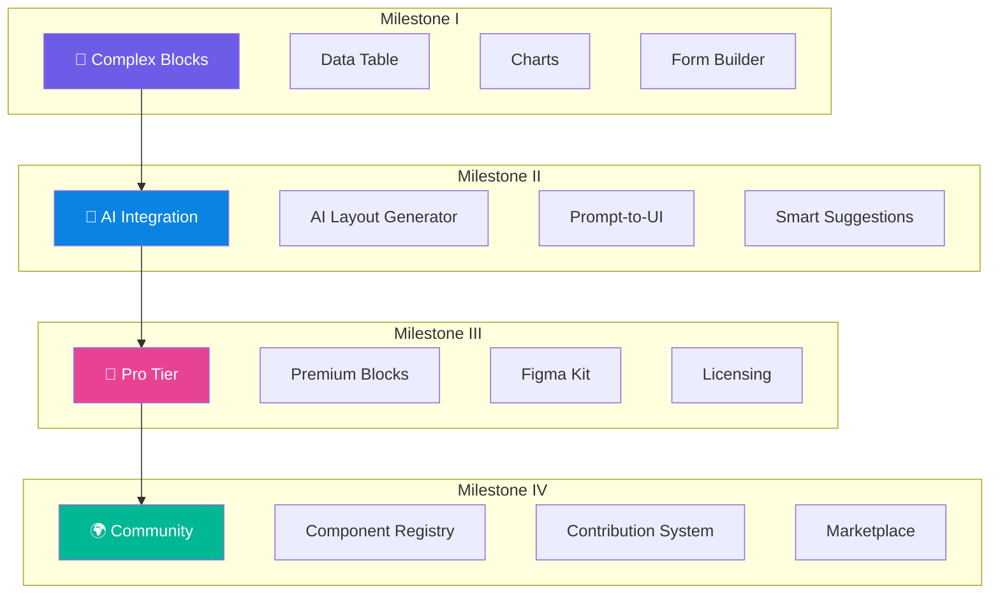
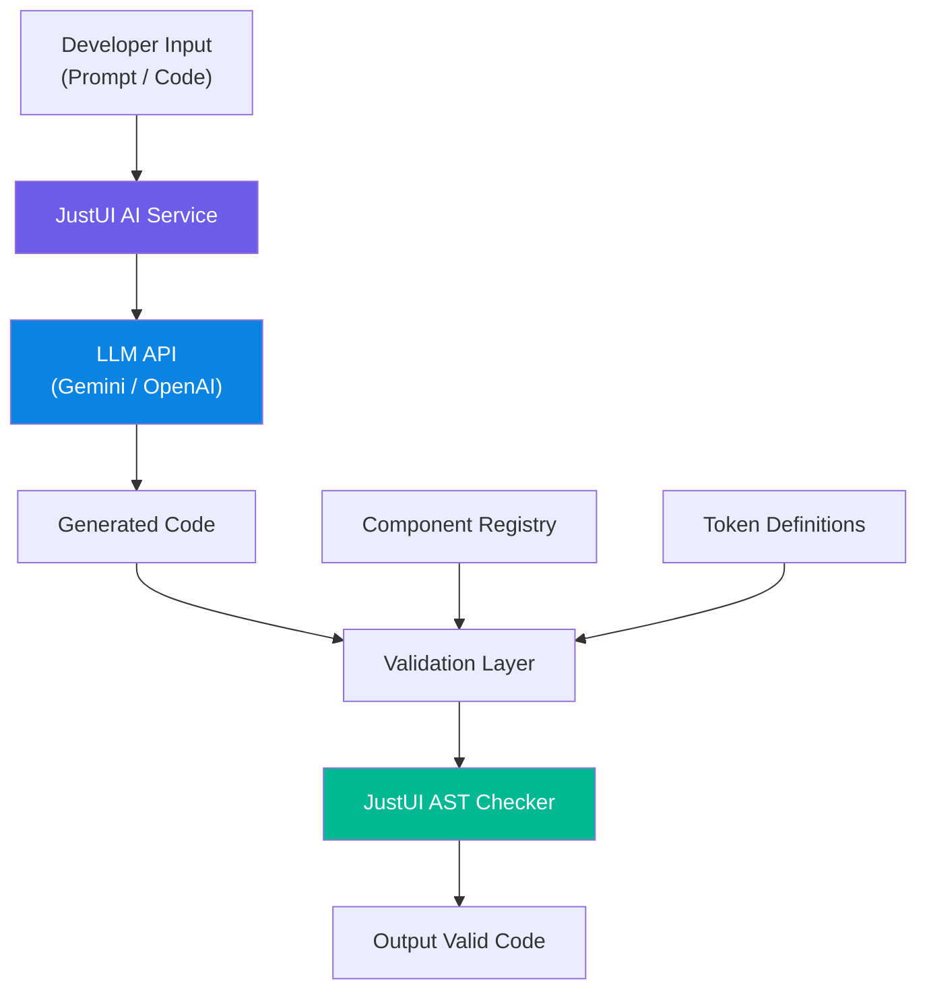
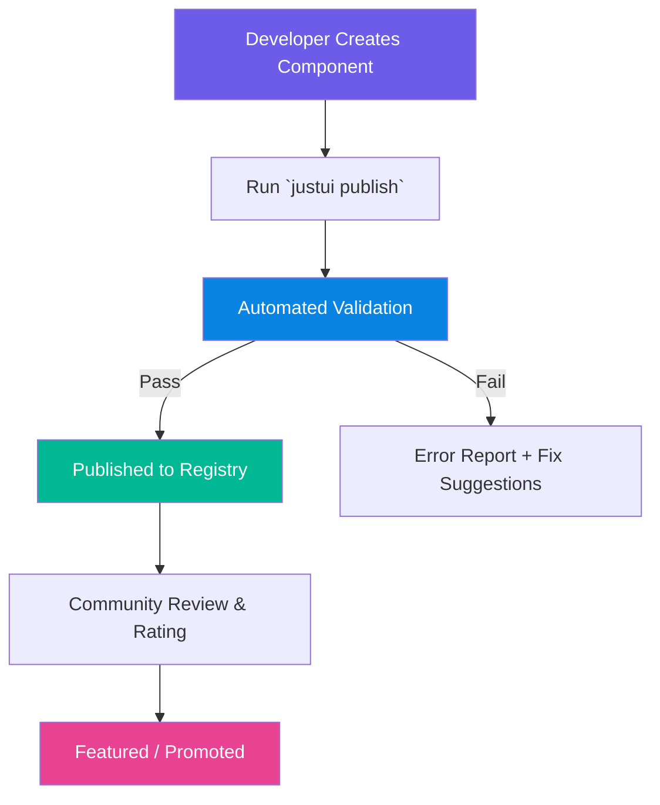
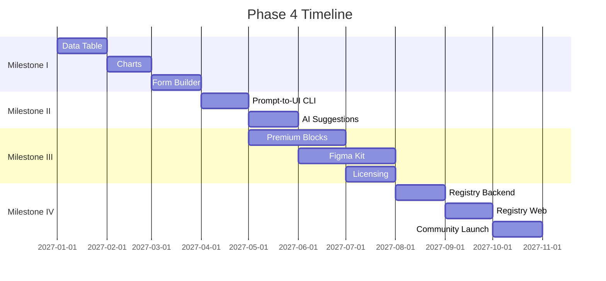

# Phase 4: Ecosystem & Growth

> **Status:** ⚪ Not Started  
> **Target:** Sprint 17–24+  
> **Packages:** `just_ui_core` (extended), `just_ui_pro` (new), `just_ui_ai` (new), `just_ui_registry` (new)  
> **Dependency:** Phase 2 & 3 harus **100% complete**, komunitas awal sudah terbentuk  
> **Prioritas:** Strategic — Fase ini mengubah JustUI dari library menjadi **ekosistem**.

---

## Gambaran Umum

Phase 4 adalah transformasi JustUI dari sebuah component library menjadi **platform ekosistem** yang self-sustaining. Fase ini mencakup komponen kompleks tingkat enterprise, integrasi AI untuk produktivitas developer, tier monetisasi (Pro), dan sistem kontribusi komunitas.



---

## Milestone I — Complex Blocks (Data Table, Charts, Form Builder)

### Deskripsi

Komponen-komponen advanced yang dibutuhkan untuk aplikasi enterprise dan data-intensive. Ini adalah komponen yang **paling sering diminta** oleh developer setelah primitif dasar tersedia.

---

### Komponen A: JustDataTable

Data table yang powerful untuk menampilkan, mengurutkan, memfilter, dan memanipulasi data tabular.

#### Features

| Feature | Deskripsi | Priority |
|---|---|---|
| **Column sorting** | Klik header untuk sort ASC/DESC | P0 |
| **Column resizing** | Drag border kolom untuk resize | P0 |
| **Row selection** | Checkbox select (single/multi/all) | P0 |
| **Pagination** | Page-based atau infinite scroll | P0 |
| **Search/Filter** | Global search + per-column filter | P0 |
| **Fixed columns** | Pin kolom kiri/kanan saat scroll horizontal | P1 |
| **Fixed header** | Header tetap saat scroll vertikal | P0 |
| **Row expansion** | Expand row untuk detail view | P1 |
| **Inline editing** | Edit cell langsung di tabel | P1 |
| **Column visibility** | Toggle show/hide kolom | P1 |
| **Column reorder** | Drag & drop reorder kolom | P2 |
| **Export** | Export ke CSV/PDF | P2 |
| **Virtualization** | Virtual scrolling untuk 10K+ rows | P0 |
| **Empty/Error state** | Custom empty dan error widgets | P0 |
| **Loading state** | Skeleton rows saat loading | P0 |

#### API Surface

```dart
class JustDataTable<T> extends StatefulWidget {
  const JustDataTable({
    required this.columns,           // List<JustDataColumn<T>>
    required this.rows,              // List<T>
    this.onRowTap,                   // void Function(T)?
    this.onSelectionChanged,         // void Function(Set<T>)?
    this.selectable = false,
    this.sortable = true,
    this.filterable = false,
    this.paginated = false,
    this.pageSize = 20,
    this.pageSizeOptions = const [10, 20, 50, 100],
    this.virtualScroll = false,
    this.rowHeight = 52,
    this.headerHeight = 48,
    this.fixedColumns = 0,           // N kolom pertama yang fixed
    this.emptyWidget,
    this.errorWidget,
    this.loadingWidget,
    this.isLoading = false,
    this.controller,                 // JustDataTableController?
    this.style,
  });
}

class JustDataColumn<T> {
  final String id;
  final String label;
  final Widget Function(T row) cellBuilder;
  final int Function(T a, T b)? comparator;  // Untuk sorting
  final double? width;
  final double? minWidth;
  final double? maxWidth;
  final bool resizable;
  final bool sortable;
  final bool visible;
  final Widget Function()? filterBuilder;     // Custom filter widget
  final Alignment alignment;
}
```

#### Performa Target

| Skenario | Target |
|---|---|
| 100 rows, 10 columns | Instant render (< 16ms) |
| 1,000 rows, 10 columns | < 100ms initial render |
| 10,000+ rows | Virtual scrolling, < 16ms per frame |
| Sort 10K rows | < 200ms |
| Filter 10K rows | < 100ms |

---

### Komponen B: JustChart

Charting library ringan yang dibangun khusus untuk JustUI, menggunakan `CustomPainter` dengan efisiensi tinggi.

#### Chart Types

| Type | Class | Use Case |
|---|---|---|
| **Line Chart** | `JustLineChart` | Trend data, time series |
| **Bar Chart** | `JustBarChart` | Comparison, distribution |
| **Pie / Donut** | `JustPieChart` | Proportion, composition |
| **Area Chart** | `JustAreaChart` | Volume over time |
| **Sparkline** | `JustSparkline` | Inline mini chart (dalam card/table) |
| **Progress** | `JustProgressChart` | Radial/linear progress |

#### Features Per Chart

| Feature | Line | Bar | Pie | Area | Sparkline |
|---|---|---|---|---|---|
| Animated entrance | ✅ | ✅ | ✅ | ✅ | ✅ |
| Tooltip on hover/tap | ✅ | ✅ | ✅ | ✅ | ❌ |
| Legend | ✅ | ✅ | ✅ | ✅ | ❌ |
| Grid lines | ✅ | ✅ | ❌ | ✅ | ❌ |
| Multi-series | ✅ | ✅ | ❌ | ✅ | ❌ |
| Responsive | ✅ | ✅ | ✅ | ✅ | ✅ |
| Theme aware | ✅ | ✅ | ✅ | ✅ | ✅ |
| Gradient fill | ✅ | ✅ | ❌ | ✅ | ✅ |
| Interactive zoom | ✅ | ❌ | ❌ | ✅ | ❌ |

#### API Surface (Line Chart Example)

```dart
class JustLineChart extends StatefulWidget {
  const JustLineChart({
    required this.series,           // List<JustLineSeries>
    this.xAxis,                     // JustAxis?
    this.yAxis,                     // JustAxis?
    this.legend,                    // JustLegend?
    this.tooltip,                   // JustChartTooltip?
    this.gridLines = true,
    this.animate = true,
    this.animationDuration,
    this.interactive = true,        // Zoom, pan, tap
    this.height = 300,
    this.padding,
    this.style,
  });
}

class JustLineSeries {
  final String name;
  final List<JustDataPoint> data;
  final Color? color;
  final double strokeWidth;
  final bool showDots;
  final bool showArea;              // Fill area below line
  final Gradient? areaGradient;
  final JustLineStyle lineStyle;    // solid, dashed, dotted
}

class JustDataPoint {
  final dynamic x;                  // String, DateTime, or num
  final num y;
  final String? label;
}
```

**Spesifikasi Teknis:**
- Rendered via `CustomPainter` — zero dependency ke external charting library.
- Smooth bezier curve interpolation untuk Line/Area chart.
- Hit testing menggunakan path-based detection untuk tooltip accuracy.
- Animasi menggunakan `Tween` + `CurvedAnimation`.
- Color palette otomatis dari theme (multi-series).
- Accessibility: tabel data alternatif via `Semantics` untuk screen readers.

---

### Komponen C: JustFormBuilder

Form builder deklaratif yang mempermudah pembuatan form kompleks dengan validasi, conditional fields, dan layout management.

#### API Surface

```dart
class JustFormBuilder extends StatefulWidget {
  const JustFormBuilder({
    required this.fields,           // List<JustFormField>
    this.onSubmit,                  // void Function(Map<String, dynamic>)?
    this.onChanged,                 // void Function(Map<String, dynamic>)?
    this.initialValues,             // Map<String, dynamic>?
    this.layout = JustFormLayout.vertical, // vertical | horizontal | grid
    this.columns = 1,               // Grid columns (untuk layout: grid)
    this.spacing,                   // double? — gap antar field
    this.submitButton,              // Widget? — custom submit button
    this.autoValidate = false,
    this.controller,                // JustFormController?
  });
}

// Field definition
abstract class JustFormField {
  final String name;                // Unique field identifier
  final String? label;
  final String? hint;
  final String? helper;
  final bool required;
  final List<JustValidator> validators;
  final bool Function(Map<String, dynamic> values)? visibleWhen; // Conditional
  final int columnSpan;             // Grid column span
}

// Built-in field types
class JustTextField extends JustFormField { ... }
class JustPasswordField extends JustFormField { ... }
class JustEmailField extends JustFormField { ... }
class JustNumberField extends JustFormField { ... }
class JustTextareaField extends JustFormField { ... }
class JustSelectField extends JustFormField { ... }
class JustMultiSelectField extends JustFormField { ... }
class JustCheckboxField extends JustFormField { ... }
class JustRadioField extends JustFormField { ... }
class JustSwitchField extends JustFormField { ... }
class JustDateField extends JustFormField { ... }
class JustDateRangeField extends JustFormField { ... }
class JustFileField extends JustFormField { ... }
class JustSliderField extends JustFormField { ... }
class JustColorField extends JustFormField { ... }
```

#### Validators

```dart
// Built-in validators
JustValidators.required("Field ini wajib diisi")
JustValidators.email("Email tidak valid")
JustValidators.minLength(8, "Minimal 8 karakter")
JustValidators.maxLength(100, "Maksimal 100 karakter")
JustValidators.pattern(RegExp(r'...'), "Format tidak valid")
JustValidators.numeric("Harus berupa angka")
JustValidators.min(0, "Tidak boleh kurang dari 0")
JustValidators.max(100, "Tidak boleh lebih dari 100")
JustValidators.match("password", "Password tidak sama")  // Cross-field validation
JustValidators.custom((value) => customLogic(value))      // Custom validator

// Composable
JustValidators.compose([
  JustValidators.required(),
  JustValidators.email(),
])
```

#### Contoh Penggunaan

```dart
JustFormBuilder(
  layout: JustFormLayout.grid,
  columns: 2,
  fields: [
    JustTextField(
      name: "firstName",
      label: "First Name",
      required: true,
    ),
    JustTextField(
      name: "lastName",
      label: "Last Name",
      required: true,
    ),
    JustEmailField(
      name: "email",
      label: "Email",
      columnSpan: 2,       // Span full width
    ),
    JustSelectField(
      name: "role",
      label: "Role",
      options: ["Admin", "Editor", "Viewer"],
    ),
    JustSwitchField(
      name: "isAdmin",
      label: "Grant admin access",
      visibleWhen: (values) => values["role"] == "Admin",
    ),
  ],
  onSubmit: (values) {
    print(values); // {"firstName": "...", "lastName": "...", ...}
  },
)
```

### Acceptance Criteria — Milestone I

- [ ] DataTable: sorting, filtering, pagination, virtual scroll, selection.
- [ ] DataTable: 10K rows rendered < 16ms per frame via virtual scroll.
- [ ] Charts: 6 chart types berfungsi dengan animasi dan tooltip.
- [ ] Charts: theme-aware colors, responsive sizing.
- [ ] FormBuilder: 15+ field types, validation, conditional fields.
- [ ] FormBuilder: grid layout dan cross-field validation.
- [ ] Semua komponen terdokumentasi di docs site.
- [ ] Widget test dan golden test per komponen.

---

## Milestone II — AI Integration (AI-Generated Layout & Prompt)

### Deskripsi

Integrasi AI untuk mempercepat produktivitas developer. Developer bisa mendeskripsikan UI yang diinginkan dalam bahasa natural, dan AI akan menghasilkan kode JustUI yang valid.

### Feature A: Prompt-to-UI (CLI)

```bash
$ dart run just_ui_cli ai generate "A login page with email and password inputs, 
a remember me checkbox, a primary login button, and a 'forgot password' link"

🤖 Generating UI from prompt...

✓ Generated: lib/pages/login_page.dart

Preview:
┌──────────────────────────────────────┐
│                                      │
│            🔒 Login                  │
│                                      │
│  ┌────────────────────────────────┐  │
│  │ Email                         │  │
│  └────────────────────────────────┘  │
│  ┌────────────────────────────────┐  │
│  │ Password                  👁  │  │
│  └────────────────────────────────┘  │
│                                      │
│  ☐ Remember me                       │
│                                      │
│  ┌────────────────────────────────┐  │
│  │         Login                  │  │
│  └────────────────────────────────┘  │
│                                      │
│         Forgot password?             │
│                                      │
└──────────────────────────────────────┘

Open file? (y/n) _
```

### Feature B: AI Layout Suggestion (IDE Plugin)

**Konsep:**
- Developer menulis widget tree secara manual.
- AI menganalisis dan menyarankan perbaikan: accessibility, responsiveness, best practices.
- Integrasi via LSP (Language Server Protocol) atau IDE extension.

```dart
// Developer menulis:
Column(
  children: [
    Text("Welcome"),
    TextField(),
    ElevatedButton(child: Text("Submit"), onPressed: () {}),
  ],
)

// AI menyarankan:
// 💡 Suggestion: Replace with JustUI components for consistency:
Column(
  spacing: JustSpacing.lg,
  children: [
    Text("Welcome", style: context.justTypo.headingMd),
    JustInput(label: "Email", hint: "Enter your email"),
    JustButton.primary(label: "Submit", onPressed: () {}),
  ],
)
```

### Feature C: Smart Component Suggestions

```bash
$ dart run just_ui_cli ai suggest --file lib/pages/home_page.dart

🤖 Analyzing home_page.dart...

Suggestions:
  1. Line 15: Container with BoxDecoration → Use JustCard.elevated()
  2. Line 28: Row with Icon + Text → Use JustBadge.soft()
  3. Line 42: ListView → Wrap with JustScrollArea for fade edges
  4. Line 55: showDialog() → Use JustDialog.confirm() for consistency

Apply suggestions? [a]ll / [s]elect / [n]one _
```

### Arsitektur AI



**Spesifikasi Teknis:**
- LLM model menggunakan Gemini API (atau configurable ke OpenAI/Anthropic).
- System prompt yang di-tune secara spesifik untuk JustUI API surface.
- Post-processing: AST validation memastikan generated code menggunakan komponen JustUI yang valid.
- Token/component registry disertakan dalam context window.
- Rate limiting dan caching untuk efisiensi API calls.
- Privacy: kode developer **tidak** dikirim ke server kecuali prompt saja (configurable).

### Acceptance Criteria — Milestone II

- [ ] `justui ai generate` menghasilkan kode valid dari prompt natural language.
- [ ] Generated code menggunakan komponen JustUI yang benar.
- [ ] AST validation menangkap 95%+ syntax error sebelum output.
- [ ] `justui ai suggest` menganalisis file dan memberikan saran actionable.
- [ ] API key configurable via `justui.config.yaml` atau env variable.
- [ ] Rate limiting dan caching berfungsi.
- [ ] Privacy-first: developer bisa opt-out dari code sharing.

---

## Milestone III — Pro Tier (Premium Blocks & Figma Kit)

### Deskripsi

Tier premium yang menyediakan komponen dan resource advance untuk kebutuhan enterprise. Ini adalah jalur monetisasi utama JustUI.

### Pro Components (Premium Blocks)

| Block | Deskripsi | Komponen yang Digunakan |
|---|---|---|
| **Kanban Board** | Drag & drop kanban dengan columns dan cards | Card, Badge, Avatar, Button |
| **Calendar** | Full calendar view (month/week/day) dengan events | Card, Badge, Dialog, Sheet |
| **Timeline** | Vertical/horizontal timeline untuk activity feeds | Card, Avatar, Badge, Separator |
| **File Manager** | Grid/list view file browser dengan preview | Card, Button, Dialog, Breadcrumb, Input |
| **Chat Interface** | Complete chat UI dengan message bubbles | Avatar, Input, Card, ScrollArea |
| **Pricing Table** | Pricing comparison cards | Card, Button, Badge, Separator |
| **Onboarding Flow** | Step-by-step onboarding wizard | Card, Button, Tabs, Input |
| **Stats Dashboard** | Pre-built analytics cards dan stat widgets | Card, Chart, Badge, Skeleton |
| **User Profile** | Complete profile page layout | Avatar, Card, Input, Button, Tabs |
| **Notification Center** | Full notification panel dengan categories | Card, Badge, Tabs, ScrollArea, Toast |
| **E-commerce Product** | Product detail page layout | Card, Button, Badge, Avatar, Tabs, Chart |
| **Checkout Flow** | Multi-step checkout form | FormBuilder, Card, Button, Input |

### Figma Kit

| Deliverable | Deskripsi |
|---|---|
| **Component Library** | Seluruh JustUI components di Figma dengan variants dan auto-layout |
| **Token Variables** | Figma Variables yang sinkron 1:1 dengan Dart tokens |
| **Icon Set** | Custom icon library (400+ icons) |
| **Template Pages** | 10+ pre-designed page templates |
| **Style Guide** | Brand guidelines dan usage documentation |
| **Dark Mode** | Semua komponen dan templates ada versi dark mode |

**Figma Kit Spesifikasi:**
- Menggunakan Figma **Variables** (bukan Styles) untuk token — memungkinkan mode switching.
- **Auto-layout** di semua komponen — responsive dan adjustable.
- **Component Properties** untuk variant switching tanpa detach instance.
- Naming convention sinkron dengan Dart code (`JustButton/Primary/Medium`).
- Changelog dokumen di Figma untuk tracking versi.

### Pricing Model

| Tier | Harga | Includes |
|---|---|---|
| **Community** (Free) | $0 | Core components, docs, CLI, community support |
| **Pro** (Individual) | $99/year | Pro blocks, Figma kit, priority support, early access |
| **Team** | $299/year | Pro + team license (5 seats), Slack channel |
| **Enterprise** | Custom | Everything + SLA, custom components, dedicated support |

### Licensing System

```dart
// justui.config.yaml
license:
  key: "JUSTUI-PRO-XXXX-XXXX-XXXX"
  type: pro     # community | pro | team | enterprise
```

```bash
$ dart run just_ui_cli add kanban-board

🔒 This is a Pro component.
   License: Pro (valid until 2027-01-15)
   
✓ Copying kanban-board component...
✓ Done!
```

**Spesifikasi Teknis:**
- License validation via API call (cached locally, re-validate weekly).
- Offline grace period: 30 hari tanpa validasi.
- License key bound ke GitHub username/email.
- Pro components di-deliver via private registry / encrypted templates.

### Acceptance Criteria — Milestone III

- [ ] 12 premium blocks selesai dan tested.
- [ ] Figma kit mencakup seluruh core + pro components.
- [ ] Figma Variables sinkron 1:1 dengan Dart tokens.
- [ ] License validation berfungsi (online dan offline grace).
- [ ] Payment integration (Stripe / Lemon Squeezy).
- [ ] Pro landing page di docs site.
- [ ] Pro components terdokumentasi (hanya preview untuk non-Pro users).

---

## Milestone IV — Community Contribution System & Registry

### Deskripsi

Membangun ekosistem komunitas yang memungkinkan siapa saja berkontribusi komponen baru ke JustUI registry, mirip dengan npm registry tetapi untuk UI components.

### Component Registry

```bash
# Publish komponen ke registry
$ dart run just_ui_cli publish my-custom-card

📦 Publishing my-custom-card v1.0.0...

Validation:
  ✓ Package structure valid
  ✓ Has README.md
  ✓ Has LICENSE
  ✓ Uses JustUI tokens
  ✓ Has at least 1 test
  ✓ dart analyze: 0 issues

Publishing to registry.justui.dev...
  ✓ Published successfully!
  
  URL: https://registry.justui.dev/components/my-custom-card
```

```bash
# Install komponen dari registry
$ dart run just_ui_cli add @community/animated-card

📥 Installing @community/animated-card v2.1.0 by @johndoe...

  ⭐ 4.8 (127 ratings) | 📥 2.3k downloads

✓ Copying component...
✓ Done!
```

### Registry Web Platform

```
registry.justui.dev/
├── /                          # Homepage — featured components
├── /explore                   # Browse all components
│   ├── ?category=layout       # Filter by category
│   ├── ?sort=popular          # Sort by popularity
│   └── ?author=johndoe        # Filter by author
├── /components/<name>         # Component detail page
│   ├── Overview               # Description, screenshots, live preview
│   ├── API                    # Props/API documentation
│   ├── Changelog              # Version history
│   └── Reviews                # Community reviews
├── /publish                   # Guide to publish components
├── /dashboard                 # Publisher dashboard
│   ├── My Components          # Manage published components
│   ├── Analytics              # Download stats, ratings
│   └── Settings               # Profile, API keys
└── /guidelines                # Contribution guidelines
```

### Quality Control

| Check | Automated? | Deskripsi |
|---|---|---|
| Structure validation | ✅ | Correct file structure dan naming |
| Token compliance | ✅ | Uses JustUI tokens, no hardcoded values |
| Dart analyze | ✅ | Zero warnings |
| Test coverage | ✅ | Minimum 1 widget test |
| README exists | ✅ | README.md dengan usage example |
| License check | ✅ | Valid OSS license |
| Security scan | ✅ | No suspicious code patterns |
| Manual review | ❌ | Community moderation untuk featured status |
| Compatibility test | ✅ | Tested terhadap JustUI core terbaru |

### Contribution Workflow



### Gamification & Incentives

| Achievement | Requirement | Reward |
|---|---|---|
| 🌱 First Publish | Publish 1 komponen | Profile badge |
| ⭐ Rising Star | 100+ downloads | Featured on homepage |
| 🔥 Popular Author | 1K+ total downloads | Verified badge |
| 💎 Top Contributor | 10+ published components, avg 4.5+ rating | Pro tier gratis 1 tahun |
| 🏆 Core Contributor | PR merged ke JustUI core | Core team badge + Pro lifetime |

### Registry API

```
POST   /api/v1/components              # Publish component
GET    /api/v1/components               # List components
GET    /api/v1/components/:name         # Get component detail
GET    /api/v1/components/:name/versions # List versions
DELETE /api/v1/components/:name         # Unpublish
POST   /api/v1/components/:name/review  # Submit review
GET    /api/v1/search?q=...            # Search components
GET    /api/v1/categories               # List categories
GET    /api/v1/authors/:id              # Author profile
```

### Acceptance Criteria — Milestone IV

- [ ] Registry web platform live dan accessible.
- [ ] `justui publish` berhasil upload komponen ke registry.
- [ ] `justui add @community/<name>` berhasil install komponen dari registry.
- [ ] Automated validation pipeline berfungsi (10 checks).
- [ ] Search dan browse berfungsi di registry web.
- [ ] Review dan rating system berfungsi.
- [ ] Publisher dashboard menampilkan analytics.
- [ ] Contribution guidelines terdokumentasi.
- [ ] Gamification badges terimplementasi.

---

## Roadmap Timeline



---

## Risiko & Mitigasi

| Risiko | Dampak | Mitigasi |
|---|---|---|
| AI-generated code berkualitas rendah | Kepercayaan developer menurun | Post-generation AST validation + linting |
| Pro tier tidak mendapat traction | Revenue stream gagal | Validasi pricing lewat survey sebelum launch, offer early-bird |
| Registry disalahgunakan (spam/malware) | Reputasi rusak | Automated security scan + manual review untuk featured |
| Figma kit tidak sinkron dengan code | Designer-developer gap | Automated sync script (Figma API → Dart tokens) |
| Community contributions berkualitas rendah | User experience buruk | Strict quality gates + rating system |
| LLM API downtime | AI features tidak available | Graceful degradation, cache last-known-good |

---

## Metrik Keberhasilan — Phase 4

| Metrik | Target |
|---|---|
| Pro subscribers | 100+ dalam 6 bulan pertama |
| Registry components | 50+ community components dalam tahun pertama |
| Monthly active CLI users | 500+ |
| Docs site monthly visitors | 5K+ |
| GitHub stars | 1K+ |
| pub.dev likes | 200+ |
| NPS (Net Promoter Score) | ≥ 50 |

---

## Definition of Done — Phase 4

- [ ] 3 complex blocks (DataTable, Charts, FormBuilder) production-ready.
- [ ] AI integration berfungsi end-to-end (prompt → valid code).
- [ ] Pro tier live dengan payment integration.
- [ ] Figma kit published dan sinkron dengan code.
- [ ] Community registry live dengan 10+ seed components.
- [ ] Publisher workflow end-to-end berfungsi.
- [ ] Analytics dan monitoring terpasang di seluruh platform.
- [ ] Business metrics tracking dashboard ready.
