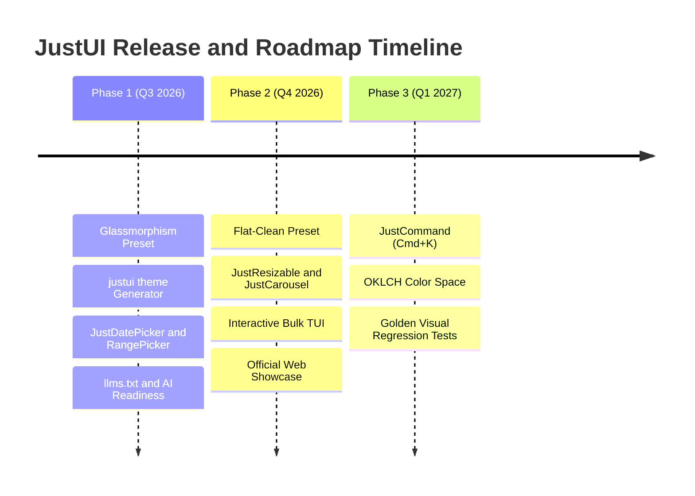

# JustUI Master Roadmap and Architecture Plan

> **Official GitHub Project Board**: [JustUI Roadmap & Planning #2](https://github.com/users/infinitedim/projects/2)  
> **Repository**: [infinitedim/justui](https://github.com/infinitedim/justui)

Dokumen ini memuat peta jalan (*roadmap*), alasan pengembangan (*rationale & motivation*), spesifikasi teknis, serta *Proof of Concept* (PoC) untuk pengembangan JustUI menjadi Flutter UI Component Library (copy-paste model) yang paling berkinerja tinggi, indah, dan ramah pengembang.

---

## Roadmap Overview



---

## Phase 1: Short-Term Milestones (Q3 2026)

### 1. Preset Style - Glassmorphism (Frosted Glass)

#### Problem Statement & Motivation
JustUI saat ini memiliki 2 visual preset (`default_` dan `neobrutalism`) via enum `JustThemePreset` dan kontrak polimorfik `JustPresetTokens`. Namun, tren desain modern (iOS/macOS system UI, Web3 dashboards, dan SaaS kontemporer) sangat bergantung pada estetika **frosted glass (glassmorphism)**. Tanpa preset bawaan, pengembang harus membungkus setiap komponen secara manual menggunakan `BackdropFilter` + `ClipRRect`, yang merusak alur kerja preset bebas konfigurasi.

#### Technical Architecture & Scope
1. **Design Tokens (`packages/just_ui_tokens`)**:
   - Berkas baru `src/blur.dart`: `JustBlur.xs` (4.0), `sm` (8.0), `md` (12.0), `lg` (16.0), `xl` (24.0).
   - Varian baru `JustThemePreset.glassmorphism` pada `color_tokens.dart`.
2. **Core Layer (`packages/just_ui_core`)**:
   - Implemen `GlassmorphismPresetTokens implements JustPresetTokens` dengan border luminous `1.0px` (`Colors.white.withOpacity(0.2)`).
   - Scheme baru `GlassShadowScheme`: bayangan drop shadow digantikan oleh pencahayaan translusen bertingkat.
   - Komponen shared baru `_shared_glass_container.dart`: kontainer dasar berbasis `ClipRRect` + `BackdropFilter(filter: ImageFilter.blur(...))`.
3. **CLI Integration (`packages/cli`)**:
   - Opsi `glassmorphism` pada wizard `init.rs` dan perintah `justui preset apply`.

#### Proof of Concept (PoC)
```dart
Widget build(BuildContext context) {
  final colors = context.justColors;
  final radius = context.justRadius;
  final blur = JustBlur.lg; // 16.0 sigma

  return ClipRRect(
    borderRadius: .all(radius.lg),
    child: BackdropFilter(
      filter: ImageFilter.blur(sigmaX: blur, sigmaY: blur),
      child: Container(
        padding: .all(context.justSpacing.lg),
        decoration: BoxDecoration(
          color: colors.card, // Resolved to translucent by preset
          borderRadius: .all(radius.lg),
          border: Border.all(color: Colors.white.withOpacity(0.2), width: 1.0),
        ),
        child: Text('Glassmorphism Card', style: context.justTypo.headingMd),
      ),
    ),
  );
}
```

---

### 2. CLI Feature - justui theme Generator

#### Problem Statement & Motivation
Saat menginisialisasi proyek baru dengan `justui init`, file `just_theme.dart` dibuat dengan warna seed default. Pengembang harus secara manual mengedit kode Dart untuk mengganti warna seed atau preset. Perintah `justui theme create --seed "#3b82f6" --preset neobrutalism` mengotomasikan pembuatan berkas tema langsung dari terminal.

#### Technical Architecture & Scope
1. **Rust CLI Subcommand (`packages/cli/src/commands/theme.rs`)**:
   - Papan perintah `justui theme create` dan `justui theme preview`.
   - Validasi regex hex: `^#?([0-9a-fA-F]{3}|[0-9a-fA-F]{6})$` (menggunakan parser hex yang sudah ada di `init.rs`).
   - Konversi format hex string ke sintaks Dart `Color(0xFF3B82F6)`.
2. **Template Parameterization (`packages/cli/src/utils/embedded_templates.rs`)**:
   - Template `just_theme.dart` dinamis dengan placeholder `{{SEED_COLOR}}` dan `{{PRESET}}`.
3. **Terminal Color Preview**:
   - Perintah `justui theme preview` mengalokasikan 11 langkah skala warna (c50-c950) di terminal menggunakan ANSI 256-color space.

#### Proof of Concept (PoC)
```rust
fn generate_theme_dart(seed_hex: &str, preset: &str, package_name: &str) -> String {
    let dart_color = hex_to_dart_color(seed_hex).unwrap();
    format!(
        r#"import 'package:flutter/material.dart';
import 'package:{package_name}/core/just_ui_core.dart';

final justThemeLight = JustThemeData.fromSeed(
  const Color({dart_color}),
  isDark: false,
  preset: JustThemePreset.{preset},
);

final justThemeDark = JustThemeData.fromSeed(
  const Color({dart_color}),
  isDark: true,
  preset: JustThemePreset.{preset},
);"#
    )
}
```

---

### 3. Component - JustDatePicker and JustDateRangePicker

#### Problem Statement & Motivation
Fungsi bawaan Flutter `showDatePicker()` mengembalikan dialog Material yang tidak dapat disesuaikan dengan preset visual JustUI (seperti garis tebal neobrutalism atau panel buram glassmorphism). Komponen `JustDatePicker` membawa integrasi tema penuh, dukungan navigasi papan ketik (WCAG 2.1), dan varian pemilih rentang tanggal (*date range*).

#### Technical Architecture & Scope
1. **Component Path**: `packages/just_ui_core/lib/src/components/date_picker/`.
2. **Key APIs**:
   - `JustDatePicker`: Varian `.inline`, `.modal`, `.dropdown`.
   - `JustDateRangePicker`: Varian pemilihan rentang dengan tombol pintas (*Today*, *Last 7 Days*, *This Month*).
3. **Keyboard Navigation & Accessibility**:
   - Tombol Panah (Move day/week), Page Up/Down (Move month), Home/End (First/Last day of month).
   - `Semantics(label: '...', selected: ...)` pada setiap sel tanggal.
   - Evaluasi kontras rasio $\ge 4.5:1$ otomatis.

#### Proof of Concept (PoC)
```dart
GridView.builder(
  shrinkWrap: true,
  gridDelegate: const SliverGridDelegateWithFixedCrossAxisCount(crossAxisCount: 7),
  itemCount: daysInMonth,
  itemBuilder: (context, index) {
    final date = DateTime(year, month, index + 1);
    final isSelected = date == selectedDate;
    return JustPressable(
      onPress: () => onDateSelected(date),
      child: Container(
        decoration: BoxDecoration(
          color: isSelected ? context.justColors.borderFocus : Colors.transparent,
          borderRadius: context.justPresetTokens.resolveBorderRadius(context.justRadius, isCircle: true),
        ),
        child: Center(child: Text('${date.day}')),
      ),
    );
  },
);
```

---

### 4. AI Ecosystem - Ship llms.txt and Agent Rules Schema

#### Problem Statement & Motivation
Asisten AI (Cursor, Copilot, Antigravity, Claude) sering kali mengalami halusinasi saat membuat kode Flutter dengan JustUI — misalnya mencoba mengimpor `package:just_ui/just_ui.dart` (yang tidak ada karena model copy-paste) atau menggunakan `Theme.of(context)`. Menyediakan `llms.txt` dan aturan AI memastikan AI menghasilkan kode yang patuh pada standar arsitektur JustUI.

#### Technical Architecture & Scope
1. **Dokumentasi AI**:
   - `llms.txt`: Ringkasan arsitektur (< 2000 token), aturan `context.justColors`, sintaks dot shorthand.
   - `llms-full.txt`: Spesifikasi lengkap API untuk seluruh 25 komponen.
   - `.cursorrules` & `.clinerules`: File aturan khusus IDE yang ditargetkan untuk agentic coding.
2. **Integrasi CLI**:
   - Scaffold otomatis `llms.txt` dan `.cursorrules` saat menjalankan `justui init`.
   - Subcommand baru `justui ai refresh` untuk memperbarui inventaris komponen secara otomatis.

#### Proof of Concept (PoC)
```markdown
# llms.txt — JustUI Rules
- Components live in `lib/widgets/` (copy-paste model), NOT pub.dev packages.
- Always use aspect extensions for theming: `context.justColors`, `context.justTypo`.
- Use Dart dot shorthand syntax: `.all(radius.lg)` instead of `BorderRadius.all(...)`.
- NEVER generate `import 'package:just_ui/just_ui.dart'`.
```

---

## Phase 2: Mid-Term Milestones (Q4 2026)

### 5. Preset Style - Flat-Clean (Soft Minimalist)

#### Problem Statement & Motivation
Aplikasi SaaS dan FinTech modern (seperti Linear, Stripe, Vercel) membutuhkan antarmuka yang bersih tanpa garis tepi tebal dan dengan bayangan ambient yang sangat halus. Preset `flatClean` mengisi celah di antara `default_` (rounded shadows) dan `neobrutalism` (thick borders).

#### Technical Architecture & Scope
1. **Tokens & Core**:
   - `JustThemePreset.flatClean` pada `color_tokens.dart`.
   - `FlatCleanPresetTokens`: `borderWidth: 0.0`, `emphasizedBorderWidth: 0.5` (hairline border untuk input).
   - `FlatCleanShadowScheme`: bayangan ambient ultra-halus (alpha $< 0.08$).
2. **Visual Impact**:
   - `JustCard`: Tanpa border visible, pemisahan visual berbasis perbedaan warna permukaan (`card` vs `background`).

#### Proof of Concept (PoC)
```dart
Container(
  padding: .all(context.justSpacing.lg),
  decoration: BoxDecoration(
    color: context.justColors.card,
    borderRadius: context.justPresetTokens.resolveBorderRadius(context.justRadius),
    boxShadow: const [
      BoxShadow(color: Color(0x06000000), blurRadius: 4, offset: Offset(0, 1)),
    ],
  ),
  child: Text('Flat-Clean Card', style: context.justTypo.bodyMd),
);
```

---

### 6. Component - JustResizable and JustCarousel

#### Problem Statement & Motivation
Aplikasi Flutter Web & Desktop memerlukan panel yang dapat diubah ukurannya (*resizable split view*) untuk antarmuka bergaya IDE atau dashboard administrative, serta komponen *carousel/banner slider* untuk aplikasi e-commerce.

#### Technical Architecture & Scope
1. **`JustResizable`**:
   - `JustResizablePanel(initialSize: 0.3, minSize: 200, collapsible: true)`.
   - Pemisah (*splitter handle*) dapat digeser via kursor mouse atau navigasi papan ketik (Panah / Shift+Panah).
2. **`JustCarousel`**:
   - Dibuat di atas `PageView` dengan `PageController(viewportFraction: 0.85)`.
   - Auto-scroll timer yang otomatis berhenti saat *hover* atau sentuhan.
   - Indikator titik (*dots*) yang menyesuaikan preset aktif.

#### Proof of Concept (PoC)
```dart
JustResizable(
  direction: Axis.horizontal,
  children: [
    JustResizablePanel(initialSize: 0.3, minSize: 200, child: SidebarWidget()),
    JustResizablePanel(initialSize: 0.7, child: MainContentWidget()),
  ],
);
```

---

### 7. CLI Feature - justui list Interactive Bulk Selector

#### Problem Statement & Motivation
Mengetik `justui add button card input avatar badge ...` satu per satu di terminal terasa lambat saat menyiapkan proyek baru. Fitur TUI interaktif berbasis `ratatui` memungkinkan pengembang memilih beberapa komponen sekaligus dengan tombol `Space` dan memasangnya secara massal.

#### Technical Architecture & Scope
1. **Modul `packages/cli/src/commands/list.rs`**:
   - Mode TUI interaktif (`justui list -i`).
   - Tampilan matriks komponen dengan status (`Installed`, `Not Installed`, `Outdated`).
   - Tombol pintas: `Space` (Toggle), `A` (Select All), `N` (Deselect), `Enter` (Confirm & Install).
2. **Alur Instalasi Massal**:
   - Traversal graf dependensi otomatis (`resolve_dependencies_recursive`) sebelum mengunduh file.

#### Proof of Concept (PoC)
```rust
let line = Line::from(vec![
    Span::styled(if is_selected { "[x] " } else { "[ ] " }, Style::default().fg(Color::Cyan)),
    Span::styled(&comp.name, Style::default().add_modifier(Modifier::BOLD)),
    Span::raw("  "),
    Span::styled(status_str, status_style),
]);
```

---

### 8. Official Interactive Web Showcase and Documentation Site

#### Problem Statement & Motivation
Pengembang membutuhkan situs dokumentasi interaktif (seperti shadcn/ui) untuk mencoba komponen, menguji preset visual secara langsung di browser, dan menyalin perintah CLI dengan 1 klik.

#### Technical Architecture & Scope
1. **Arsitektur Stack**:
   - Situs Dokumentasi: Next.js (App Router) + MDX.
   - Preview Komponen: Aplikasi Flutter Web yang di-embed via `iframe` dengan komunikasi `postMessage` untuk pengubahan preset & tema secara instan.
2. **Fitur Utama**:
   - Live Preview & Interactive Playground.
   - Generator Tema & Checker Kontras WCAG AA.
   - 1-Click Copy CLI Command.

---

## Phase 3: Long-Term Milestones (Q1 2027)

### 9. Component - JustCommand (Command Palette / KBar)

#### Problem Statement & Motivation
Papan Perintah (*Command Palette* `Cmd+K` / `Ctrl+K`) adalah standar navigasi cepat pada aplikasi produktivitas modern (VS Code, Linear, Slack, Notion).

#### Technical Architecture & Scope
1. **Component Path**: `packages/just_ui_core/lib/src/components/command/`.
2. **Fitur Utama**:
   - Listener pintasan global (`Cmd+K` / `Ctrl+K`).
   - Algoritma *fuzzy search* lokal untuk pencarian aksi & navigasi rute.
   - Pengolahan fokus papan ketik lengkap (*focus trapping* & navigasi panah atas/bawah).

#### Proof of Concept (PoC)
```dart
JustCommandScope(
  actions: [
    JustCommandAction(
      id: 'toggle_dark',
      label: 'Toggle Dark Mode',
      shortcut: 'Ctrl+Shift+D',
      onExecute: () => themeController.toggle(),
    ),
  ],
  child: MyApp(),
);
```

---

### 10. Color Space Upgrade - OKLCH and HSLuv Support

#### Problem Statement & Motivation
Ruang warna HSL memiliki kelemahan dasar yaitu *lightness* yang tidak seragam secara persepsional (warna kuning pada `L=50%` terlihat jauh lebih terang daripada warna biru pada `L=50%`). Memperbarui generator skala warna `JustColorScale.fromSeed` ke **OKLCH** memastikan setiap langkah bayangan (c50-c950) memiliki bobot visual yang konsisten.

#### Technical Architecture & Scope
1. **Modul Baru (`packages/just_ui_tokens/lib/src/colors/oklch.dart`)**:
   - Konversi sRGB $\to$ Linear RGB $\to$ OKLab $\to$ OKLCH (tanpa pustaka eksternal).
2. **Skala Warna Persepsional**:
   - `JustColorScale.fromSeed(seed, useOklch: true)` menghasilkan skala warna dengan kecerahan visual seragam di semua hue.

#### Proof of Concept (PoC)
```dart
final oklch = OklchColor.fromColor(seed);
Color makeShade(double targetL) =>
    OklchColor(targetL, oklch.chroma * _chromaCurve(targetL), oklch.hue).toColor();
```

---

### 11. Automated Golden Visual Regression Testing

#### Problem Statement & Motivation
Dengan 25 komponen, 3+ preset, dan 2 tema (Light/Dark), JustUI memiliki lebih dari **300+ keadaan visual unik**. Pengujian visual regresif otomatis (*golden tests*) mencegah perubahan kode tidak disengaja yang merusak tampilan komponen.

#### Technical Architecture & Scope
1. **Test Infrastructure (`packages/just_ui_core/test/golden/`)**:
   - `GoldenTestHarness` untuk isolasi lingkungan pengujian tema.
   - Generator matriks varian otomatis untuk menangkap state Normal, Hover, Pressed, Disabled, dan Focused.
2. **CI Pipeline**:
   - GitHub Actions workflow (`flutter test --update-goldens=false`).

#### Proof of Concept (PoC)
```dart
testWidgets('JustButton neobrutalism golden', (tester) async {
  await tester.pumpWidget(
    GoldenTestHarness(
      preset: JustThemePreset.neobrutalism,
      isDark: false,
      child: JustButton(label: 'Button', onPressed: () {}),
    ),
  );
  await expectLater(
    find.byType(Scaffold),
    matchesGoldenFile('goldens/button_neobrutalism_light.png'),
  );
});
```
